# 软件设计说明（SDD）

**项目名称：** 中译中 —— 中文语境翻译器
**项目代号：** ZYZ-V1.0
**版本：** V1.0（大纲版）
**日期：** 2026-06-29
**状态：** 大纲待确认

---

## 1 范围 ⭐⭐⭐

### 1.1 标识
本条应描述本文档所适用系统和软件的完整标识，（若适用）包括其标识号、名称、缩略名、版本号和发布号。

| 项目 | 内容 |
|---|---|
| 软件名称 | 中译中（中文语境翻译器） |
| 英文名称 | ZhongYiZhong |
| 版本号 | V1.0 |
| 项目代号 | ZYZ-V1.0 |
| 文档编号 | ZYZ-SDD-V1.0 |

### 1.2 系统概述
本条应概述本文档适用的系统和软件的用途：描述系统和软件的一般特性（如规模、安全性、可靠性、实时性、技术风险等特性）；概述系统开发、运行和维护的历史；标识项目的需方、用户、开发方和保障机构等；标识当前和计划的运行现场；列出其他有关文档。

### 1.3 文档概述
本条应概述本文档的用途和内容，并描述与它的使用有关的安全保密方面的要求。

---

## 2 引用文档 ⭐

本章应列出引用文档的编号、标题、编写单位、修订版及日期，还应给出不能通过正常渠道得到的文档的来源。

---

## 3 CSCI 级设计决策 ⭐⭐⭐（重点章节）

本章应根据需要分条给出 CSCI 级设计决策，即 CSCI 行为设计的决策（忽略其内部实现，从用户角度出发描述系统将怎样运转以满足需求）和其他影响组成该 CSCI 的软件单元的选择与设计的决策，并给出决策的理由。

### 3.1 总体技术路线决策

#### 3.1.1 前端技术栈

| 技术 | 版本 | 用途 | 选型理由 |
|---|---|---|---|
| Uni-app | 3.x | 跨端开发框架 | 一套代码同时编译为 H5、微信小程序、App（iOS/Android），大幅降低多端开发成本；生态成熟，社区活跃，问题可快速检索解决 |
| Vue.js | 3.x（Composition API） | 前端框架 | 语法简洁，学习曲线平缓；响应式系统完善；Composition API 提供更好的逻辑复用和代码组织能力 |
| uView UI | 2.x | 主组件库 | 组件丰富（60+ 组件），覆盖日常开发需求；文档完善，示例丰富；跨端兼容性好，适配 uni-app 全平台 |
| uni-ui | 1.x | 补充组件库 | 官方组件库，与 uni-app 原生能力深度集成；提供 uView 未覆盖的特定场景组件 |
| Pinia | 2.x | 状态管理 | Vue 官方推荐的新一代状态管理库；TypeScript 友好；支持状态持久化；相比 Vuex 更简洁，无 mutations 概念 |
| ucharts | 2.x | 图表库 | 轻量级跨端图表库；支持 H5/小程序/App；性能优秀，动画流畅 |

#### 3.1.2 后端技术栈

| 技术 | 版本 | 用途 | 选型理由 |
|---|---|---|---|
| Python | 3.11 | 开发语言 | 语法简洁，开发效率高；AI/ML 生态丰富；异步支持完善；团队熟悉度高 |
| FastAPI | 0.100+ | Web 框架 | 基于 Starlette + Pydantic，异步高性能；自动生成交互式 API 文档（Swagger UI / ReDoc）；类型提示驱动，开发体验好；自动数据校验 |
| SQLAlchemy | 2.0 | ORM 框架 | Python 生态最成熟的 ORM；支持异步（asyncpg）；功能强大，支持复杂查询；迁移工具 Alembic 完善 |
| Pydantic | 2.x | 数据校验 | 与 FastAPI 深度集成；基于类型提示的数据校验；序列化/反序列化性能优秀 |
| Uvicorn | 0.23+ | ASGI 服务器 | 异步高性能；支持 HTTP/1.1 和 WebSocket；生产环境可用 |

#### 3.1.3 AI 服务技术栈

| 技术 | 用途 | 选型理由 |
|---|---|---|
| OpenAI API 兼容协议 | 大模型调用标准 | 行业事实标准，支持多家大模型厂商（OpenAI、Anthropic、国内大模型等）；切换成本低 |
| 多模型路由 | 模型调度 | 根据任务类型（翻译、生成、分类）智能选择最优模型；平衡成本与效果 |
| 语义缓存 | 响应缓存 | 基于向量相似度的缓存机制；相同/相似问题直接返回缓存结果；降低 API 调用成本 |

#### 3.1.4 总体架构图

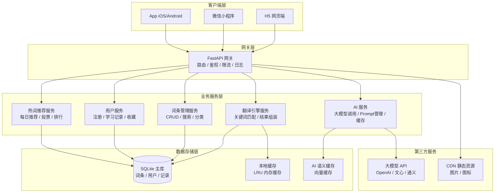

#### 3.1.5 选型决策总结

**核心设计思想：**
- **轻量起步，平滑升级**：初期使用 SQLite + 单节点部署，快速验证产品；后续按需升级到 MySQL + 分布式部署
- **前后端彻底分离**：通过 RESTful API 解耦，前端可独立迭代、多端发布
- **AI 能力可插拔**：AI 服务独立封装，支持多模型切换、降级策略，不影响核心功能
- **缓存优先**：多级缓存（内存缓存 + 语义缓存 + 前端缓存），降低 AI 调用成本，提升响应速度

### 3.2 AI 调用策略决策

#### 3.2.1 调用时机策略

**分级调用机制：**

| 场景 | 触发条件 | 是否调用 AI | 说明 |
|---|---|---|---|
| 词条详情页 | 查看预设词条 | 否 | 直接返回词条库内容，包含释义、例句、风险等级 |
| 热词卡片 | 每日推荐热词 | 否 | 预生成内容，走缓存 |
| 词典模式翻译 | 关键词匹配 | 否 | 纯关键词匹配，返回命中词条列表 |
| 整句翻译（人话模式） | 用户输入完整句子 | 是 | AI 结合词条库做深度翻译、潜台词分析 |
| 潜台词解读 | 用户主动点击 | 是 | 针对特定句子/词条生成潜台词分析 |
| 行动建议 | 用户主动点击 | 是 | 基于语境生成应对建议 |
| 用户提交词条审核 | 用户提交新词条 | 是（异步） | AI 辅助审核，生成建议分类和风险等级 |

**调用决策流程：**

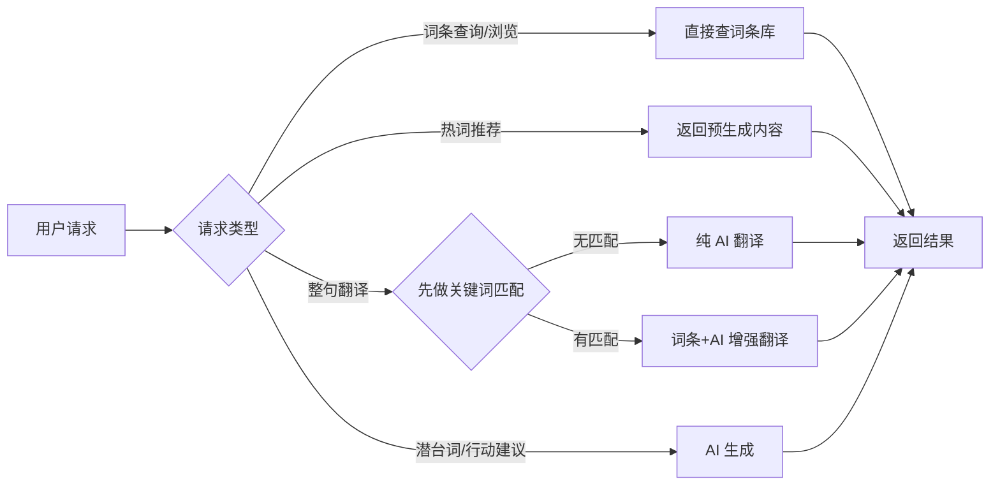

#### 3.2.2 失败降级策略

**三级降级机制：**

| 降级级别 | 触发条件 | 降级行为 | 用户感知 |
|---|---|---|---|
| L1 正常 | AI 服务可用 | 完整 AI 功能 | 正常使用 |
| L2 部分降级 | AI 响应超时（>3s）或限流 | 保留词典模式，提示"AI 服务繁忙，已切换到词典模式" | 功能受限，有明确提示 |
| L3 完全降级 | AI 服务不可用 | 仅提供词条库查询、热词浏览、收藏等基础功能 | 功能受限，有明确提示 |

**降级触发条件：**
- 网络连接超时（>5s）
- API 返回 429（限流）
- API 返回 5xx（服务端错误）
- 连续 3 次调用失败
- 服务端健康检查失败

**自动恢复机制：**
- 每 30 秒探测一次 AI 服务可用性
- 探测成功后自动恢复到正常模式
- 指数退避重试策略：1s → 2s → 4s → 8s → 最大 60s

#### 3.2.3 缓存策略

**多级缓存体系：**

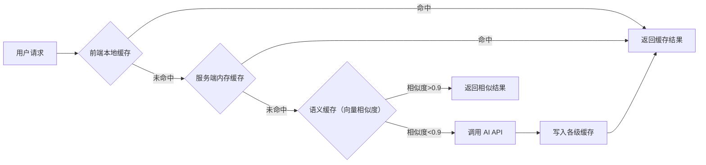

**缓存层级细节：**

| 缓存层级 | 存储介质 | 缓存内容 | 有效期 | 容量限制 | 命中率目标 |
|---|---|---|---|---|---|
| L1 前端缓存 | localStorage / 本地存储 | 常用词条、最近翻译结果 | 7 天 | 10MB | 30% |
| L2 服务端内存缓存 | Python LRU Cache | 高频翻译结果、热词数据 | 1 小时 | 1000 条 | 20% |
| L3 语义缓存 | SQLite + 向量相似度 | 相似问题翻译结果 | 7 天 | 10000 条 | 25% |

**缓存 Key 设计：**
- 词条查询：`word:{word_id}`
- 翻译结果：`translate:{hash(text)}:{mode}`
- 语义缓存：向量相似度匹配，阈值 0.9

**缓存更新策略：**
- 被动失效：TTL 到期自动删除
- 主动更新：词条内容变更时主动清除相关缓存
- LRU 淘汰：容量满时淘汰最久未使用的条目

#### 3.2.4 成本控制策略

**成本控制维度：**

| 控制维度 | 具体措施 | 预期效果 |
|---|---|---|
| 调用量控制 | 每日每用户 AI 调用上限（免费版 20 次/天） | 防止滥用 |
| Token 优化 | 精简 Prompt，控制上下文长度；使用流式输出时按需截断 | 降低单请求成本 30%+ |
| 模型路由 | 简单任务用小模型（如 gpt-3.5-turbo），复杂任务用大模型 | 平衡成本与质量 |
| 缓存命中 | 多级缓存，提升缓存命中率 | 降低实际 API 调用量 50%+ |
| 批量处理 | 热词、示例数据预生成，非实时调用 | 错峰调用，利用闲时优惠 |
| 失败重试 | 指数退避，最多重试 2 次 | 避免无效重试浪费成本 |

**模型路由策略：**

| 任务类型 | 推荐模型 | 理由 |
|---|---|---|
| 关键词提取 / 分类 | 轻量模型（如 gpt-3.5-turbo） | 任务简单，小模型足够 |
| 整句翻译 / 潜台词 | 中等模型 | 平衡质量和成本 |
| 复杂语境分析 / 行动建议 | 高级模型 | 质量要求高 |
| 数据审核 / 预处理 | 轻量模型 + 规则引擎 | 批量处理，成本敏感 |

**成本监控告警：**
- 日成本统计与趋势分析
- 超预算自动告警（80% 预警，100% 限流）
- 单用户异常调用检测（防刷）
- 按接口维度统计调用量和成本

### 3.3 内容安全策略决策

#### 3.3.1 三级风险体系

**风险等级定义：**

| 风险等级 | 标识颜色 | 判定标准 | 示例 | 占比目标 |
|---|---|---|---|---|
| 低风险 | 绿色 | 普通职场用语、网络流行语、行业术语，无负面含义 | "复盘"、"对齐"、"赋能"、"抓手" | ~70% |
| 中风险 | 黄色 | 带有一定讽刺、调侃意味的用语，可能引起部分人不适，需结合语境判断 | "PUA"、"画饼"、"摸鱼"、"卷" | ~25% |
| 高风险 | 红色 | 涉及人身攻击、歧视、违法违规、低俗内容的用语 | 辱骂性词汇、歧视性表述、违法相关黑话 | ~5% |

**风险判定维度：**

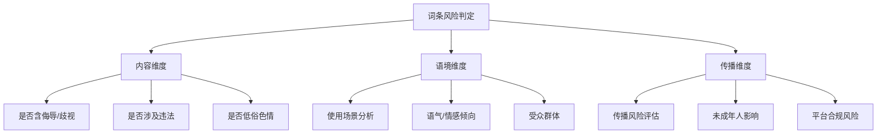

**风险等级流转规则：**
- 初始定级：词条入库时由运营人员初定风险等级
- AI 辅助审核：新词条提交后，AI 自动给出风险建议等级
- 人工复核：中高风险词条必须人工审核确认
- 动态调整：根据用户举报、使用场景变化调整风险等级

#### 3.3.2 内容审核机制

**三级审核流程：**

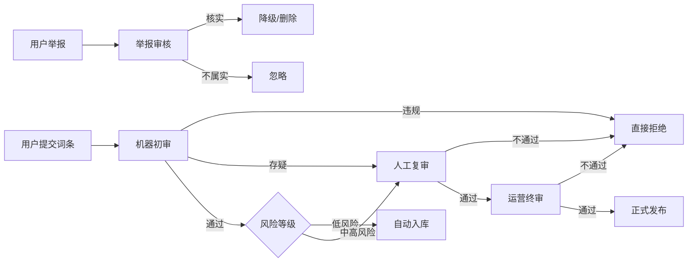

**审核要点：**

| 审核环节 | 审核主体 | 审核内容 | 时效要求 |
|---|---|---|---|
| 机器初审 | AI + 关键词过滤 | 敏感词检测、风险等级预判、格式校验 | 实时（<1s） |
| 人工复审 | 运营人员 | 中高风险词条内容审核、分类准确性 | 24 小时内 |
| 运营终审 | 运营负责人 | 高风险词条最终确认、争议词条裁定 | 48 小时内 |
| 举报处理 | 运营人员 | 用户举报内容核实、处理 | 24 小时内 |

**AI 安全审核 Prompt 设计要点：**
- 明确禁止输出的内容类别（违法、色情、暴力、歧视等）
- 要求对高风险词条增加警示说明
- 禁止生成规避审核的话术或方法
- 输出内容必须积极正向，以帮助理解为目的
- 涉及敏感话题时引导用户通过正规渠道了解

#### 3.3.3 分级展示规则

**不同风险等级的展示策略：**

| 风险等级 | 搜索展示 | 详情展示 | 分享传播 | 热词推荐 | AI 使用限制 |
|---|---|---|---|---|---|
| 低风险 | 正常展示 | 完整展示释义、例句、语境分析 | 允许分享 | 可推荐 | 无限制 |
| 中风险 | 正常展示，但标注黄色警示标识 | 完整展示 + 语境说明 + 使用建议 | 允许分享，但增加提示 | 限制推荐（降低权重） | 限制生成攻击性内容 |
| 高风险 | 搜索结果模糊化，需主动点击确认查看 | 仅展示释义和风险警示，不提供例句、不提供传播建议 | 禁止分享 | 禁止推荐 | 严格限制，仅做解释说明 |

**高风险词条展示规则：**
- 搜索结果中词条名称部分脱敏（如用 * 替代部分字符）
- 点击查看前弹出风险提示："该词条可能包含不适内容，确认继续查看？"
- 详情页顶部显著红色风险警示条
- 仅提供客观释义和风险说明，不提供使用场景、例句、行动建议
- 不显示相关推荐、不支持分享、不支持收藏
- 底部增加"举报"入口

**前端展示组件设计：**
- `RiskBadge` 风险等级标签组件（绿/黄/红三色）
- `RiskWarning` 风险警示条组件
- `BlurOverlay` 内容模糊遮罩组件（高风险内容确认前展示）
- `ReportButton` 举报按钮组件

#### 3.3.4 用户生成内容（UGC）管理

**用户提交词条规范：**
- 必须填写词条名称、释义、使用场景（必填）
- 可填写例句、相关词条（选填）
- 必须选择分类（单选）
- 提交前需勾选"内容合规承诺"
- 同一用户同一词条 24 小时内只能提交一次

**用户行为管控：**

| 行为 | 处理方式 | 升级路径 |
|---|---|---|
| 提交低质量词条 | 驳回 + 提示改进建议 | 累计 3 次驳回限制提交 7 天 |
| 提交违规词条 | 驳回 + 警告 | 累计 2 次封禁提交功能 |
| 恶意举报 | 警告 | 累计 3 次限制举报功能 |
| 传播违规内容 | 删除内容 + 警告 | 严重者封禁账号 |

**合规底线（零容忍）：**
- 违反国家法律法规的内容
- 涉黄涉赌涉毒涉暴内容
- 民族/种族/性别/地域歧视内容
- 人身攻击、诽谤、侮辱内容
- 诱导未成年人不良行为的内容
- 宣扬邪教、迷信的内容

### 3.4 数据存储决策

#### 3.4.1 SQLite 选型理由

**SQLite vs 其他数据库对比：**

| 对比维度 | SQLite | MySQL | PostgreSQL | MongoDB |
|---|---|---|---|---|
| 部署复杂度 | 零配置，单文件 | 需要安装配置服务 | 需要安装配置服务 | 需要安装配置服务 |
| 资源占用 | 极低（<1MB） | 较高（百MB级） | 较高（百MB级） | 高（数百MB） |
| 并发能力 | 读并发好，写串行化 | 高并发 | 高并发 | 高并发 |
| 数据量上限 | ~140TB（理论） | 理论无限 | 理论无限 | 理论无限 |
| 性能（小数据量） | 极快 | 快 | 快 | 较快 |
| 迁移成本 | 低（改连接串即可） | - | 中 | 高（NoSQL 转 SQL） |
| 运维成本 | 几乎为零 | 需要 DBA | 需要 DBA | 需要 DBA |
| 适用阶段 | MVP / 中小规模 | 中大规模 | 中大规模 | 大规模 / 非结构化 |

**选型核心理由：**
1. **零运维成本**：单个数据库文件，无需安装服务，备份只需复制文件
2. **开发效率高**：FastAPI + SQLAlchemy 天然支持，开发无需关注数据库运维
3. **性能足够**：初期用户量 < 10 万、日活 < 1 万、数据量 < 100 万条时，SQLite 性能完全满足
4. **平滑迁移**：通过 SQLAlchemy ORM 抽象，后续迁移到 MySQL/PostgreSQL 只需修改配置
5. **部署简单**：与应用同机部署，减少网络开销，降低系统复杂度

**性能边界预估：**

| 指标 | 预估阈值 | 触发迁移条件 |
|---|---|---|
| 并发用户数 | < 1000 QPS | 持续 > 500 QPS |
| 数据库文件大小 | < 10GB | 持续增长 > 5GB |
| 日写入量 | < 10 万条 | 持续 > 5 万条/天 |
| 单表数据量 | < 1000 万条 | 单表 > 500 万条 |

#### 3.4.2 数据分类与存储方案

**数据分类体系：**

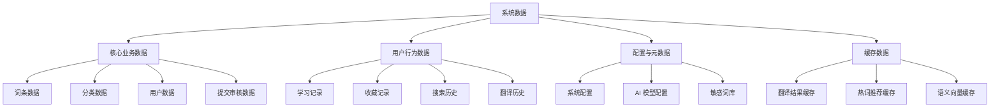

**各类型数据存储方案：**

| 数据类型 | 存储介质 | 存储位置 | 持久化 | 备份策略 |
|---|---|---|---|---|
| 词条/分类/用户 | SQLite | 主数据库 | 是 | 每日全量 + 实时 WAL |
| 学习/收藏记录 | SQLite | 主数据库 | 是 | 每日全量 + 实时 WAL |
| 用户提交/审核 | SQLite | 主数据库 | 是 | 每日全量 + 实时 WAL |
| 系统配置 | SQLite | 主数据库 | 是 | 每日全量 |
| 翻译结果缓存 | SQLite + 内存 | 缓存库 | 半持久化 | TTL 自动过期 |
| 热词推荐缓存 | 内存 LRU | 服务端内存 | 否 | 定期重建 |
| 前端用户数据 | localStorage | 客户端本地 | 否 | 用户手动备份 |
| 静态资源 | 本地文件 + CDN | 服务器 / CDN | 是 | CDN 自动备份 |

#### 3.4.3 备份与恢复策略

**备份体系：**

| 备份类型 | 备份方式 | 频率 | 保留周期 | 存储位置 | 恢复时间 |
|---|---|---|---|---|---|
| 实时备份 | WAL 日志模式 | 实时 | 7 天 | 本地磁盘 | < 1 分钟 |
| 全量备份 | SQLite 在线备份（VACUUM INTO） | 每日凌晨 | 30 天 | 本地 + 云存储 | < 5 分钟 |
| 增量备份 | 基于 WAL 日志 | 每小时 | 7 天 | 本地磁盘 | < 10 分钟 |
| 归档备份 | 每月全量备份归档 | 每月 | 永久 | 云存储 | < 30 分钟 |

**备份执行流程：**

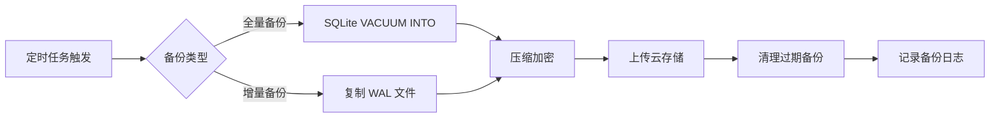

**灾难恢复等级：**

| 故障场景 | 恢复目标 RPO | 恢复目标 RTO | 恢复方案 |
|---|---|---|---|
| 应用崩溃 | < 1 分钟 | < 5 分钟 | 重启应用，WAL 自动恢复 |
| 数据库损坏 | < 1 小时 | < 30 分钟 | 恢复最近全量备份 + 增量 WAL |
| 服务器故障 | < 4 小时 | < 2 小时 | 迁移到备用服务器，恢复云备份 |
| 数据误删除 | < 24 小时 | < 1 小时 | 从归档备份中恢复指定数据 |

#### 3.4.4 升级路径与迁移方案

**分阶段升级路线：**


**各阶段详细说明：**

| 阶段 | 数据库方案 | 适用规模 | 关键技术 | 预估用户量 |
|---|---|---|---|---|
| 阶段一 | SQLite 单文件 | MVP / 小规模 | SQLite + WAL 模式 | < 10 万 |
| 阶段二 | 主库 SQLite + 读副本 | 中小规模 | 只读副本、连接池优化 | 10 万 - 50 万 |
| 阶段三 | MySQL 主从复制 | 中规模 | MySQL + 连接池 + 分表 | 50 万 - 500 万 |
| 阶段四 | MySQL 分库分表 / NewSQL | 大规模 | ShardingSphere / TiDB | > 500 万 |

**SQLite → MySQL 迁移方案：**

1. **数据迁移工具**：
   - 使用 SQLAlchemy 的 `automap` 反射现有表结构
   - 编写迁移脚本，分批导出导入数据
   - 迁移时进行数据类型映射（SQLite 类型 → MySQL 类型）

2. **迁移步骤**：
   - Step 1：修改数据库配置，新增 MySQL 连接
   - Step 2：创建 MySQL 表结构（通过 SQLAlchemy 自动生成）
   - Step 3：全量数据迁移（历史数据）
   - Step 4：增量同步（双写一段时间）
   - Step 5：切换读流量到 MySQL
   - Step 6：切换写流量到 MySQL
   - Step 7：下线 SQLite 主库

3. **兼容性处理**：
   - SQLite 自增主键 → MySQL AUTO_INCREMENT
   - SQLite 无类型 → MySQL 严格类型
   - SQLite LIKE 大小写不敏感 → MySQL BINARY/COLLATE
   - SQLite JSON 存储为 TEXT → MySQL JSON 类型

#### 3.4.5 数据安全与隐私

**数据安全措施：**
- 数据库文件权限控制（仅应用进程可读写）
- 敏感数据加密存储（用户设备 ID 哈希、密码等）
- 备份文件 AES 加密后上传云存储
- SQL 注入防护（SQLAlchemy ORM + 参数化查询）
- 定期安全审计（访问日志、异常操作检测）

**隐私保护原则：**
- 最小必要原则：只收集必要的用户数据
- 匿名化处理：用户数据去标识化，无法关联到真实身份
- 用户控制权：用户可查询、删除自己的数据
- 数据留存期限：用户注销后 30 天内删除所有数据

### 3.5 前端架构决策

#### 3.5.1 uView + uni-ui 选型

**双组件库组合策略：**

| 组件库 | 定位 | 优势 | 适用场景 |
|---|---|---|---|
| uView UI 2.x | 主力组件库 | 组件丰富（60+）、文档完善、示例丰富、主题定制灵活 | 表单、列表、卡片、弹窗等通用业务组件 |
| uni-ui 1.x | 补充组件库 | 官方维护、与 uni-app 深度集成、原生能力好 | 导航栏、标签栏、下拉刷新等系统级组件 |

**选型理由：**
1. **组件覆盖全面**：uView 覆盖绝大多数业务场景，uni-ui 补充 uView 缺少的原生能力组件
2. **跨端一致性**：两个组件库均针对 uni-app 优化，H5/小程序/App 表现一致
3. **主题定制能力**：uView 支持 SCSS 变量覆盖，可一键切换主题色
4. **社区生态成熟**：遇到问题容易找到解决方案，降低开发风险
5. **性能优化良好**：组件按需引入，包体积可控

**组件使用规范：**
- 优先使用 uView 组件，功能不满足时再考虑 uni-ui
- 系统级组件（导航、Tabbar）优先用 uni-ui，保证原生体验
- 避免重复引入功能相似的组件
- 公共组件基于 uView/uni-ui 二次封装，统一业务风格

#### 3.5.2 Pinia 状态管理

**状态管理架构：**

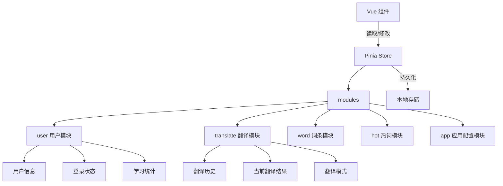

**Store 模块划分：**

| Store 模块 | 职责 | 持久化 | 数据示例 |
|---|---|---|---|
| user | 用户信息、登录状态、学习统计、收藏列表 | 是 | userId、nickname、learnCount、favorites |
| translate | 翻译模式、当前翻译结果、翻译历史 | 部分 | mode、currentResult、history（最近20条） |
| word | 词条分类缓存、搜索历史 | 是 | categories、searchHistory |
| hot | 每日热词、学习进度 | 否 | dailyWords、learnProgress |
| app | 应用配置、主题设置、版本信息 | 是 | theme、fontSize、version |

**选择 Pinia 而非 Vuex 的理由：**
1. **API 更简洁**：无 mutations 概念，直接修改 state，代码更简洁
2. **TypeScript 友好**：完整的类型推断，IDE 智能提示完善
3. **Vue 3 官方推荐**：Vue 官方团队维护，与 Vue 3 生态深度集成
4. **模块化更自然**：每个 Store 独立文件，按需导入，代码分割友好
5. **热更新支持**：开发时修改 Store 无需刷新页面
6. **DevTools 支持**：完善的开发调试工具支持

**状态持久化方案：**
- 使用 `pinia-plugin-persistedstate` 插件
- 支持部分状态持久化（指定需要持久化的字段）
- 存储介质自适应：H5 用 localStorage，App/小程序用 uni.storage
- 敏感数据加密存储

#### 3.5.3 接口封装设计

**请求封装架构：**

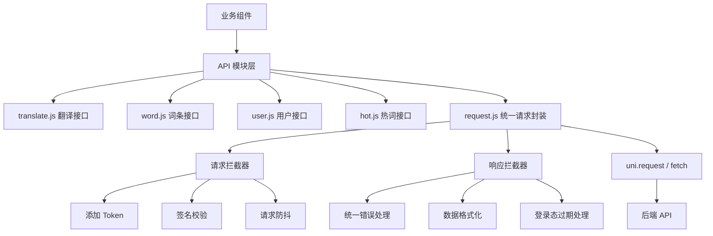

**request.js 核心功能：**

| 功能点 | 实现说明 |
|---|---|
| 基础配置 | baseURL、timeout（10s）、headers 默认值 |
| 请求拦截器 | 自动添加 Authorization Token、请求时间戳、设备信息 |
| 响应拦截器 | 统一解析响应格式、错误码处理、登录过期跳转 |
| 错误处理 | 网络错误、超时、业务错误分类处理，统一 Toast 提示 |
| 请求取消 | 支持取消请求，页面卸载时自动取消未完成请求 |
| 重试机制 | 网络错误自动重试 1 次，幂等请求可重试 |
| 请求缓存 | GET 请求支持缓存（可配置缓存时间） |
|  loading 状态 | 自动管理 loading 显示/隐藏，防止重复点击 |

**统一响应格式约定：**
```json
{
  "code": 0,
  "message": "success",
  "data": {},
  "timestamp": 1234567890
}
```

**错误码分类处理：**
| 错误码 | 说明 | 处理方式 |
|---|---|---|
| 0 | 成功 | 正常返回 data |
| 400 | 参数错误 | Toast 提示错误信息 |
| 401 | 未登录 / Token 过期 | 清除登录态，跳转登录页 |
| 403 | 无权限 | Toast 提示"无操作权限" |
| 429 | 请求频繁 | Toast 提示"操作过于频繁，请稍后再试" |
| 500 | 服务器错误 | Toast 提示"服务器繁忙，请稍后再试" |

#### 3.5.4 跨端适配方案

**跨端适配策略：**

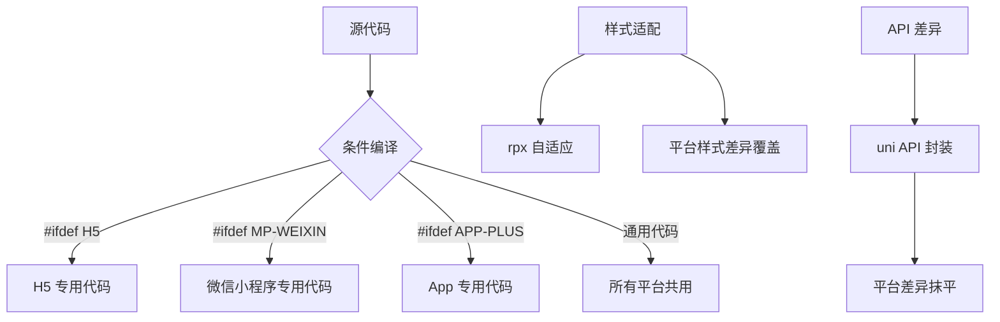

**页面级适配策略：**

| 适配维度 | 方案 | 说明 |
|---|---|---|
| 布局适配 | rpx 单位 + flex 布局 | uni-app 内置，自动适配不同屏幕尺寸 |
| 状态栏适配 | uni.getSystemInfo + 安全区域 | 适配刘海屏、灵动岛、底部安全区域 |
| 导航栏适配 | 自定义导航栏 + 平台判断 | H5/小程序/App 导航栏高度不同 |
| 字体适配 | 响应式字号 + 系统字体栈 | 不同平台默认字体不同，统一视觉 |
| 输入框适配 | 平台差异化处理 | 小程序键盘弹起逻辑与 H5 不同 |

**条件编译使用规范：**
- 页面级差异：使用 `#ifdef` / `#ifndef` 条件编译
- 组件级差异：封装跨端兼容组件，内部处理差异
- 样式差异：使用平台特定 class 覆盖
- API 差异：封装统一工具函数，内部判断平台

**各平台特殊处理：**

| 平台 | 特殊处理项 |
|---|---|
| H5 | 浏览器兼容（IE 不考虑）、路由模式（hash/history）、分享能力降级、复制粘贴适配 |
| 微信小程序 | 小程序审核规范、登录授权、分享卡片、订阅消息、支付能力 |
| App（iOS/Android） | 原生能力调用（相机、定位、通知）、应用商店审核、版本更新、推送通知 |

**性能优化适配：**
- 长列表：使用 uView 的 `list` 组件 + 虚拟滚动
- 图片：懒加载 + 渐进式加载 + WebP 格式（支持的平台）
- 分包：小程序端按功能模块分包，减少主包体积
- 预加载：关键页面数据预加载，提升用户体验

---

## 4 CSCI 体系结构设计 ⭐⭐⭐（重点章节）

本章应分为以下子条描述 CSCI 体系结构设计。

### 4.1 系统总体架构

#### 4.1.1 三层架构设计

**总体架构：** 前后端分离的三层架构 + 服务化设计

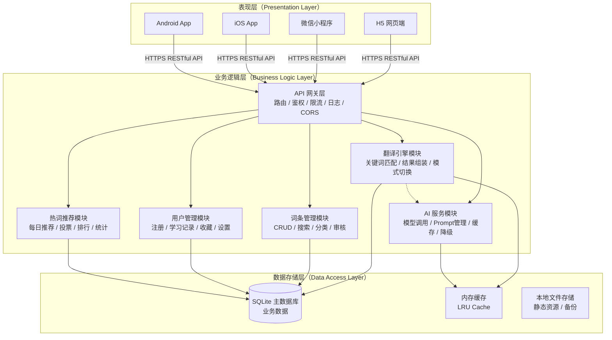

#### 4.1.2 各层职责说明

| 层级 | 职责范围 | 核心能力 | 技术实现 |
|---|---|---|---|
| 表现层 | 用户交互、页面展示、输入输出 | 页面渲染、状态管理、表单校验、本地缓存、跨端适配 | Uni-app + Vue 3 + uView + Pinia |
| 业务逻辑层 | 业务规则处理、流程编排、安全校验 | 翻译引擎、AI 服务、用户管理、权限控制、限流降级 | FastAPI + SQLAlchemy + Pydantic |
| 数据存储层 | 数据持久化、缓存、事务 | 数据 CRUD、事务管理、索引优化、备份恢复 | SQLite + WAL 模式 + LRU 缓存 |

**分层设计原则：**
- **单一职责**：每层只负责自己的事情，不越界
- **自上而下依赖**：上层依赖下层，下层不感知上层
- **接口隔离**：层与层之间通过接口/契约通信，不直接依赖实现
- **可替换性**：每层可独立替换，不影响其他层（如 SQLite → MySQL）

#### 4.1.3 核心数据流

**翻译请求数据流：**

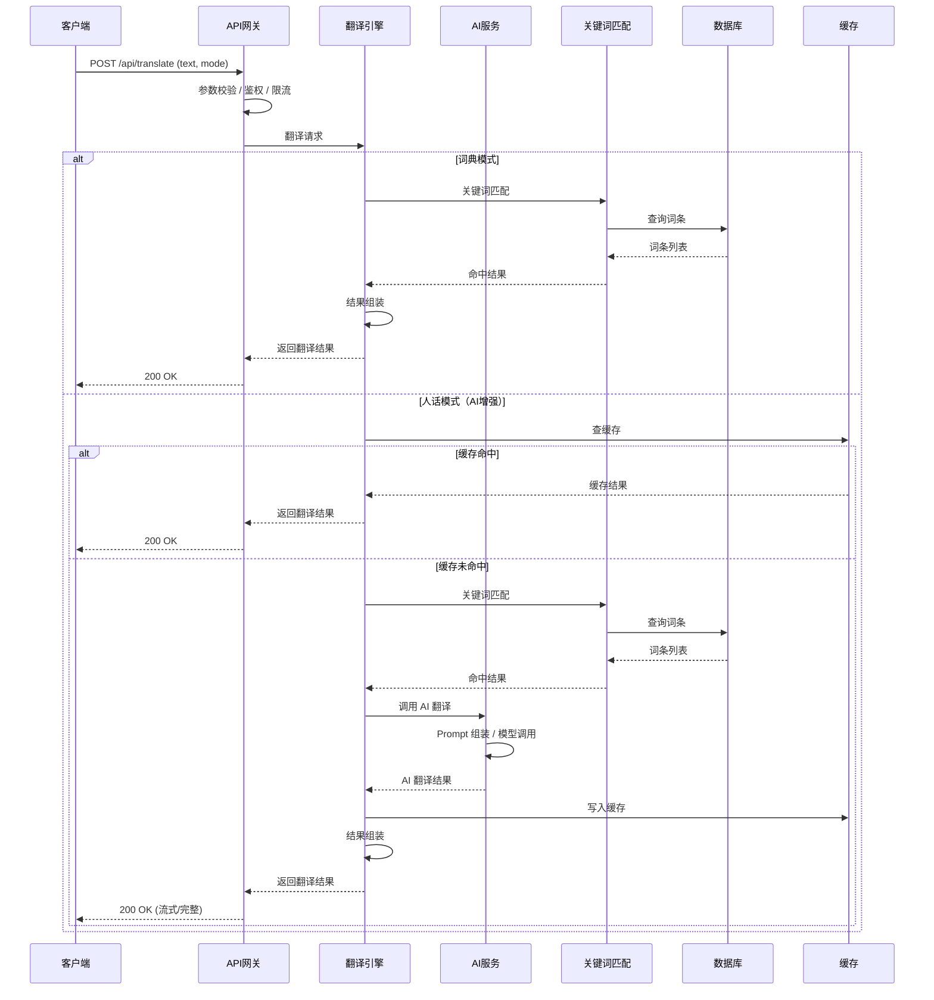

**用户学习热词数据流：**

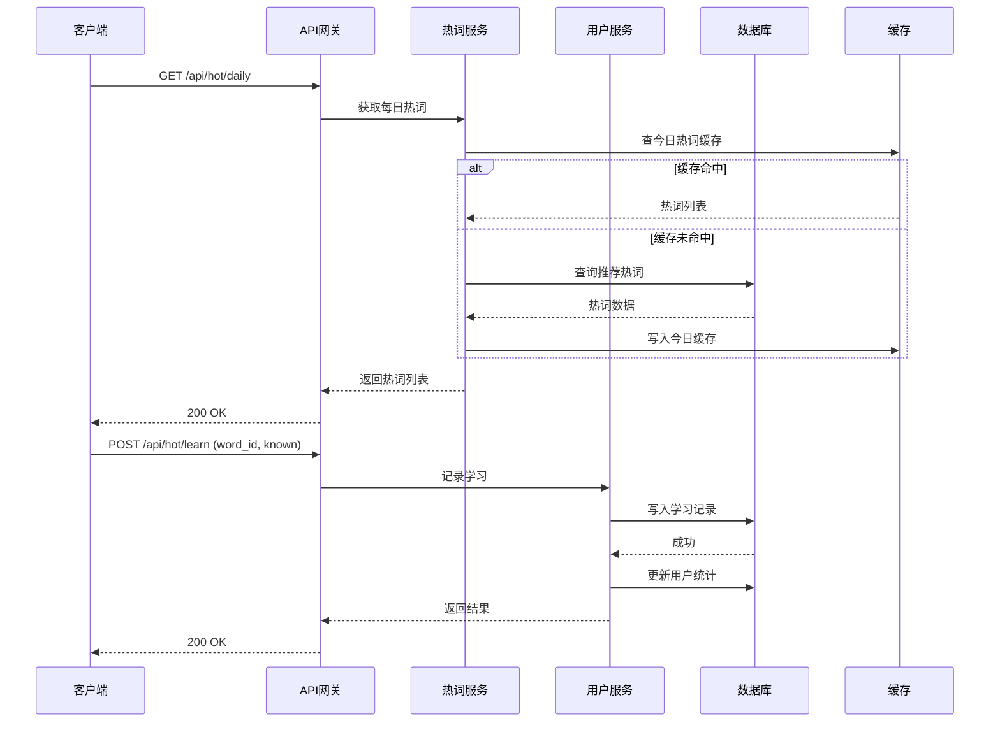

#### 4.1.4 部署架构

**单节点部署架构（MVP 阶段）：**

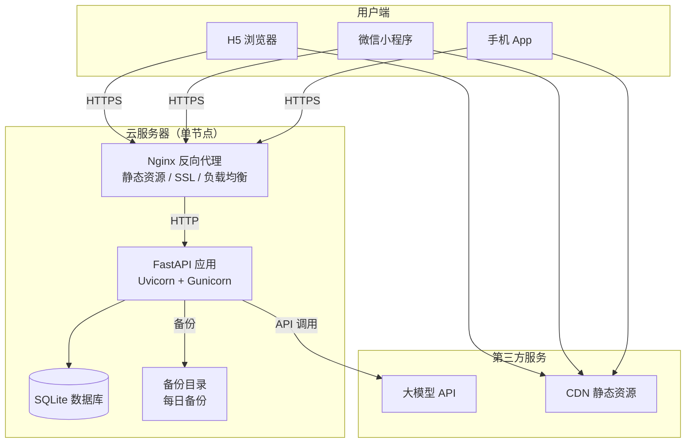

**部署配置说明：**

| 组件 | 配置建议 | 说明 |
|---|---|---|
| 服务器 | 2核4G / 40GB SSD | 初期可选择云服务器入门配置 |
| 操作系统 | Ubuntu 22.04 LTS | 稳定、文档丰富 |
| Nginx | 最新稳定版 | 反向代理、静态资源、HTTPS |
| Python | 3.11 | 性能优化版本 |
| Uvicorn | 多 worker 模式 | Gunicorn 管理，4 worker |
| SQLite | 系统自带 / 最新版 | WAL 模式开启 |
| 数据库备份 | 每日自动备份到云存储 | 脚本 + crontab |

**后续扩展方向：**
1. 水平扩展：应用服务器增加，Nginx 负载均衡
2. 数据库升级：SQLite → MySQL，主从复制
3. 缓存升级：增加 Redis 缓存层
4. CDN 加速：静态资源全量 CDN
5. 容器化部署：Docker + Docker Compose

### 4.2 前端架构设计（Uni-app）

#### 4.2.1 完整目录结构

```
app/
├── pages/                          # 页面目录
│   ├── index/                      # 翻译页（首页 Tab1）
│   │   ├── index.vue               # 页面主文件
│   │   └── components/             # 页面私有组件
│   │       ├── TranslateInput.vue  # 翻译输入框
│   │       ├── ModeTabs.vue        # 翻译模式切换
│   │       └── ResultCard.vue      # 翻译结果卡片
│   ├── hot/                        # 热词页（Tab2）
│   │   ├── index.vue               # 热词首页
│   │   ├── learn.vue               # 学习模式（卡片滑动）
│   │   └── ranking.vue             # 热词排行榜
│   ├── dict/                       # 词条页（Tab3）
│   │   ├── index.vue               # 分类首页
│   │   ├── category.vue            # 分类词条列表
│   │   └── search.vue              # 搜索页
│   ├── mine/                       # 我的页（Tab4）
│   │   ├── index.vue               # 个人中心首页
│   │   ├── favorites.vue           # 我的收藏
│   │   ├── history.vue             # 学习历史
│   │   ├── settings.vue            # 设置页
│   │   └── submissions.vue         # 我的提交
│   └── word-detail/                # 词条详情页（非 Tab）
│       └── index.vue               # 词条详情
│
├── components/                     # 全局公共组件
│   ├── common/                     # 基础组件
│   │   ├── RiskBadge.vue           # 风险等级标签
│   │   ├── RiskWarning.vue         # 风险警示条
│   │   ├── EmptyState.vue          # 空状态组件
│   │   └── LoadMore.vue            # 加载更多
│   ├── word/                       # 词条相关组件
│   │   ├── WordCard.vue            # 词条卡片
│   │   ├── WordList.vue            # 词条列表
│   │   ├── WordTag.vue             # 词条标签
│   │   └── WordDetail.vue          # 词条详情内容
│   ├── translate/                  # 翻译相关组件
│   │   ├── TranslateResult.vue     # 翻译结果展示
│   │   ├── SubtextSection.vue      # 潜台词区块
│   │   └── SuggestionSection.vue   # 行动建议区块
│   └── hot/                        # 热词相关组件
│       ├── HotSwiperCard.vue       # 热词滑动卡片
│       ├── HotRankItem.vue         # 排行项
│       └── ProgressBar.vue         # 学习进度条
│
├── api/                            # 接口层
│   ├── request.js                  # 统一请求封装（拦截器、错误处理）
│   ├── translate.js                # 翻译相关接口
│   ├── word.js                     # 词条相关接口
│   ├── category.js                 # 分类相关接口
│   ├── user.js                     # 用户相关接口
│   ├── hot.js                      # 热词相关接口
│   └── submission.js               # 提交相关接口
│
├── store/                          # Pinia 状态管理
│   ├── index.js                    # Store 入口
│   └── modules/                    # 模块目录
│       ├── user.js                 # 用户模块
│       ├── translate.js            # 翻译模块
│       ├── word.js                 # 词条模块
│       ├── hot.js                  # 热词模块
│       └── app.js                  # 应用配置模块
│
├── utils/                          # 工具函数
│   ├── storage.js                  # 本地存储封装
│   ├── format.js                   # 格式化工具
│   ├── validate.js                 # 校验工具
│   ├── debounce.js                 # 防抖节流
│   └── platform.js                 # 平台判断工具
│
├── styles/                         # 全局样式
│   ├── index.scss                  # 样式入口
│   ├── variables.scss              # SCSS 变量（主题色、间距等）
│   ├── mixins.scss                 # SCSS 混入
│   └── reset.scss                  # 样式重置
│
├── static/                         # 静态资源
│   ├── images/                     # 图片资源
│   ├── icons/                      # 图标资源
│   └── tabbar/                     # TabBar 图标
│
├── config/                         # 配置文件
│   ├── env.js                      # 环境配置
│   └── routes.js                   # 路由配置
│
├── App.vue                         # 应用入口
├── main.js                         # 主入口文件
├── pages.json                      # 页面配置
├── manifest.json                   # 应用配置
└── uni.scss                        # uni-app 全局样式变量
```

#### 4.2.2 模块划分

**四大核心模块：**

| 模块 | 对应页面 | 核心功能 | 状态依赖 |
|---|---|---|---|
| 翻译模块 | pages/index | 文本输入、模式切换、词典匹配、AI 翻译、结果展示、翻译历史 | translate store |
| 热词模块 | pages/hot | 每日热词推荐、卡片滑动学习、认识/不认识投票、热词排行、学习进度 | hot store + user store |
| 词条模块 | pages/dict + word-detail | 分类浏览、词条搜索、词条详情、相关推荐、收藏操作 | word store |
| 用户模块 | pages/mine | 用户信息、学习记录、收藏管理、提交记录、设置、意见反馈 | user store + app store |

**模块依赖关系图：**

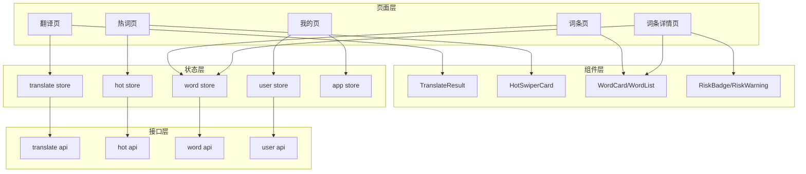

#### 4.2.3 核心组件设计

**基础组件：**

| 组件名 | 路径 | 功能描述 | Props | Events |
|---|---|---|---|---|
| RiskBadge | components/common/RiskBadge.vue | 风险等级标签（绿/黄/红） | level: 'low' \| 'medium' \| 'high' | - |
| RiskWarning | components/common/RiskWarning.vue | 风险警示条 | level, text | close |
| EmptyState | components/common/EmptyState.vue | 空状态展示 | icon, text, btnText | btnClick |
| LoadMore | components/common/LoadMore.vue | 加载更多 | status: 'more' \| 'loading' \| 'noMore' | loadMore |

**业务组件：**

| 组件名 | 路径 | 功能描述 | Props | Events |
|---|---|---|---|---|
| WordCard | components/word/WordCard.vue | 词条卡片 | wordData, showRisk | click |
| WordList | components/word/WordList.vue | 词条列表 | wordList, showRisk | itemClick, loadMore |
| WordTag | components/word/WordTag.vue | 词条标签 | text, type | click |
| TranslateResult | components/translate/TranslateResult.vue | 翻译结果展示 | resultData, mode | copy, share |
| SubtextSection | components/translate/SubtextSection.vue | 潜台词区块 | subtextList | - |
| SuggestionSection | components/translate/SuggestionSection.vue | 行动建议区块 | suggestionList | - |
| HotSwiperCard | components/hot/HotSwiperCard.vue | 热词滑动卡片 | wordData | swipeLeft, swipeRight, click |
| HotRankItem | components/hot/HotRankItem.vue | 热词排行项 | rank, wordData | click |
| ProgressBar | components/hot/ProgressBar.vue | 学习进度条 | current, total | - |

#### 4.2.4 状态管理设计

**Pinia Store 详细设计：**

**1. user store（用户模块）**

| State | 类型 | 说明 | 持久化 |
|---|---|---|---|
| userId | String | 用户 ID | 是 |
| nickname | String | 用户昵称 | 是 |
| avatar | String | 头像 URL | 是 |
| token | String | 登录 Token | 是 |
| isLoggedIn | Boolean | 是否已登录 | 是 |
| learnCount | Number | 累计学习词条数 | 是 |
| learnDays | Number | 连续学习天数 | 是 |
| favoriteIds | Array | 收藏的词条 ID 列表 | 是 |

| Actions | 参数 | 说明 |
|---|---|---|
| register | deviceId | 设备 ID 注册 |
| login | token | Token 登录 |
| logout | - | 退出登录 |
| updateProfile | data | 更新用户信息 |
| toggleFavorite | wordId | 切换收藏状态 |
| incrementLearn | - | 学习计数 +1 |

**2. translate store（翻译模块）**

| State | 类型 | 说明 | 持久化 |
|---|---|---|---|
| mode | String | 当前翻译模式（dict / human） | 是 |
| currentResult | Object | 当前翻译结果 | 否 |
| history | Array | 翻译历史（最近 20 条） | 是 |
| isLoading | Boolean | 是否翻译中 | 否 |

| Actions | 参数 | 说明 |
|---|---|---|
| setMode | mode | 切换翻译模式 |
| translate | text, mode | 执行翻译 |
| clearResult | - | 清空当前结果 |
| addHistory | item | 添加到历史记录 |
| clearHistory | - | 清空历史记录 |

**3. word store（词条模块）**

| State | 类型 | 说明 | 持久化 |
|---|---|---|---|
| categories | Array | 分类列表 | 是 |
| searchHistory | Array | 搜索历史（最近 10 条） | 是 |
| currentWord | Object | 当前查看词条 | 否 |

| Actions | 参数 | 说明 |
|---|---|---|
| fetchCategories | - | 获取分类列表 |
| searchWords | keyword | 搜索词条 |
| getWordDetail | id | 获取词条详情 |
| addSearchHistory | keyword | 添加搜索历史 |
| clearSearchHistory | - | 清空搜索历史 |

**4. hot store（热词模块）**

| State | 类型 | 说明 | 持久化 |
|---|---|---|---|
| dailyWords | Array | 今日热词列表 | 否 |
| learnProgress | Object | 今日学习进度 | 否 |
| rankingList | Array | 热词排行榜 | 否 |

| Actions | 参数 | 说明 |
|---|---|---|
| fetchDailyWords | - | 获取每日热词 |
| recordLearn | wordId, known | 记录学习 |
| fetchRanking | type | 获取排行榜 |

**5. app store（应用配置模块）**

| State | 类型 | 说明 | 持久化 |
|---|---|---|---|
| theme | String | 主题（light / dark） | 是 |
| fontSize | String | 字体大小（small / medium / large） | 是 |
| showRiskWarning | Boolean | 是否显示风险提示 | 是 |
| version | String | 当前版本号 | 是 |

| Actions | 参数 | 说明 |
|---|---|---|
| setTheme | theme | 切换主题 |
| setFontSize | size | 切换字体大小 |
| toggleRiskWarning | - | 切换风险提示开关 |

### 4.3 后端架构设计（FastAPI）

#### 4.3.1 完整目录结构

```
backend/
├── main.py                    # FastAPI 应用入口，创建 app，注册路由和中间件
├── config.py                  # 配置管理（环境变量、配置文件）
│
├── core/                      # 核心模块（基础设施）
│   ├── database.py            # 数据库连接、Session 管理
│   ├── security.py            # 安全相关（Token、密码哈希、鉴权）
│   ├── exceptions.py          # 自定义异常类
│   ├── logger.py              # 日志配置
│   └── middleware.py          # 自定义中间件
│
├── models/                    # SQLAlchemy 数据模型层
│   ├── __init__.py
│   ├── base.py                # 基础模型（公共字段）
│   ├── word.py                # 词条、分类、别名、关系模型
│   ├── user.py                # 用户、学习记录、收藏模型
│   ├── hot.py                 # 热词、投票、排行模型
│   └── submission.py          # 用户提交、审核模型
│
├── schemas/                   # Pydantic 模型层（请求/响应 DTO）
│   ├── __init__.py
│   ├── base.py                # 基础响应模型
│   ├── translate.py           # 翻译相关 Schema
│   ├── word.py                # 词条相关 Schema
│   ├── category.py            # 分类相关 Schema
│   ├── user.py                # 用户相关 Schema
│   ├── hot.py                 # 热词相关 Schema
│   └── submission.py          # 提交相关 Schema
│
├── crud/                      # 数据库操作层（CRUD）
│   ├── __init__.py
│   ├── base.py                # 基础 CRUD 类
│   ├── word.py                # 词条 CRUD
│   ├── category.py            # 分类 CRUD
│   ├── user.py                # 用户 CRUD
│   ├── hot.py                 # 热词 CRUD
│   └── submission.py          # 提交 CRUD
│
├── api/                       # 路由层（API 接口）
│   ├── __init__.py
│   ├── dependencies.py        # 路由依赖（获取 DB Session、当前用户等）
│   └── v1/                    # API v1 版本
│       ├── __init__.py
│       ├── translate.py       # 翻译接口
│       ├── word.py            # 词条接口
│       ├── category.py        # 分类接口
│       ├── user.py            # 用户接口
│       ├── hot.py             # 热词接口
│       └── submission.py      # 提交接口
│
├── services/                  # 业务服务层
│   ├── __init__.py
│   ├── translator/            # 翻译引擎服务
│   │   ├── __init__.py
│   │   ├── engine.py          # 翻译引擎主逻辑
│   │   ├── matcher.py         # 关键词匹配器
│   │   └── assembler.py       # 结果组装器
│   ├── ai/                    # AI 服务
│   │   ├── __init__.py
│   │   ├── client.py          # AI 客户端封装
│   │   ├── prompts.py         # Prompt 模板管理
│   │   ├── cache.py           # AI 响应缓存
│   │   └── fallback.py        # 降级策略
│   ├── hot/                   # 热词推荐服务
│   │   ├── __init__.py
│   │   ├── recommender.py     # 推荐算法
│   │   └── ranking.py         # 排行榜计算
│   └── content_security/      # 内容安全服务
│       ├── __init__.py
│       ├── risk_assessor.py   # 风险评估
│       └── audit.py           # 内容审核
│
├── cache/                     # 缓存层
│   ├── __init__.py
│   ├── memory_cache.py        # 内存缓存（LRU）
│   └── semantic_cache.py      # 语义缓存
│
├── middleware/                # 中间件
│   ├── __init__.py
│   ├── logging_middleware.py  # 请求日志中间件
│   ├── rate_limiter.py        # 限流中间件
│   └── cors_middleware.py     # CORS 中间件
│
├── utils/                     # 工具函数
│   ├── __init__.py
│   ├── hash.py                # 哈希工具
│   ├── token.py               # Token 工具
│   └── datetime_util.py       # 日期时间工具
│
├── tests/                     # 测试目录
│   ├── __init__.py
│   ├── test_translate.py      # 翻译接口测试
│   ├── test_word.py           # 词条接口测试
│   └── test_user.py           # 用户接口测试
│
├── data/                      # 数据目录
│   ├── init_data.py           # 初始数据导入脚本
│   ├── seed_words.json        # 初始词条数据
│   └── categories.json        # 初始分类数据
│
├── requirements.txt           # Python 依赖
├── .env.example               # 环境变量示例
└── README.md                  # 后端说明文档
```

#### 4.3.2 分层架构设计

**四层架构：**

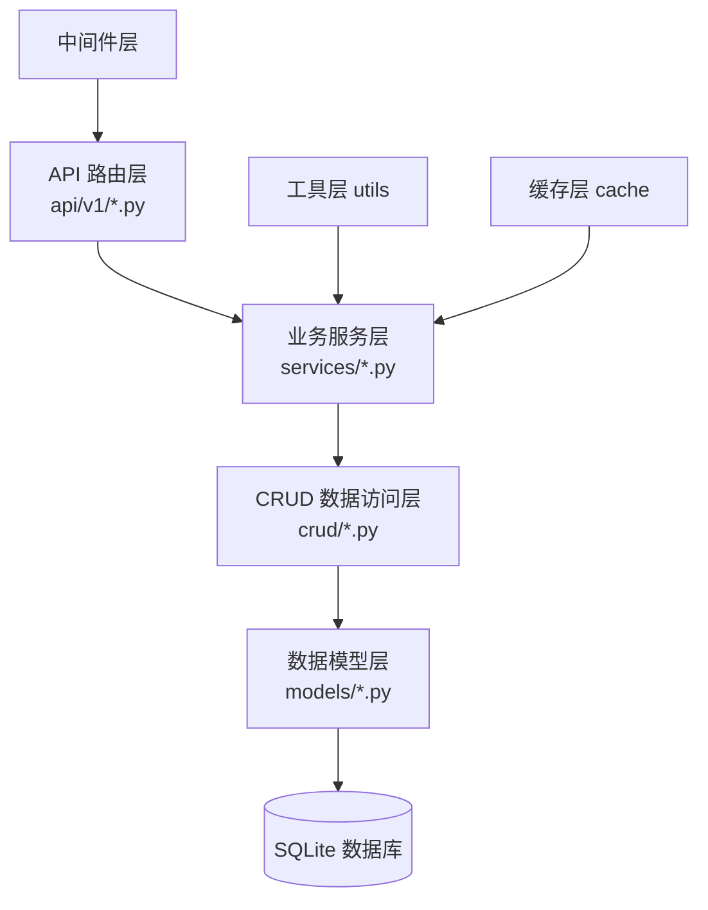

**各层职责说明：**

| 层级 | 职责 | 禁止做的事 | 技术实现 |
|---|---|---|---|
| API 路由层 | 接收请求、参数校验、调用服务、返回响应 | 不写业务逻辑、不直接操作数据库 | FastAPI + Pydantic |
| 业务服务层 | 业务规则处理、流程编排、事务控制 | 不直接拼接 SQL、不处理 HTTP 细节 | 纯 Python 类 + 函数 |
| CRUD 数据访问层 | 数据库 CRUD 操作、查询封装 | 不写业务逻辑、不处理业务异常 | SQLAlchemy ORM |
| 数据模型层 | 表结构定义、字段类型、关系映射 | 不写业务逻辑 | SQLAlchemy Model |

**架构优势：**
1. **职责清晰**：每层只做自己的事，代码可读性高
2. **易于测试**：各层可独立单元测试
3. **易于扩展**：替换数据库/框架只需改对应层
4. **复用性好**：CRUD 和服务可被多个路由复用

#### 4.3.3 FastAPI + SQLAlchemy 选型理由

**FastAPI 核心优势：**

| 优势 | 说明 | 业务价值 |
|---|---|---|
| 高性能 | 基于 Starlette + Pydantic，异步性能媲美 Node.js/Go | 支撑高并发翻译请求 |
| 自动文档 | 自动生成 Swagger UI / ReDoc 交互式 API 文档 | 前后端联调效率提升 50%+ |
| 类型驱动 | 基于 Python 类型提示，自动数据校验和序列化 | 减少参数校验代码，减少 Bug |
| 异步支持 | 原生支持 async/await，异步 I/O 性能好 | AI 调用等 I/O 密集场景性能好 |
| 依赖注入 | 强大的 DI 系统，代码解耦 | 便于测试和扩展 |
| 生态丰富 | 集成 SQLAlchemy、Pydantic、Uvicorn 等 | 开箱即用，开发效率高 |

**SQLAlchemy 2.0 核心优势：**

| 优势 | 说明 | 业务价值 |
|---|---|---|
| 功能强大 | 支持复杂查询、关联、事务、迁移 | 满足复杂业务需求 |
| ORM + Core | 既可面向对象，也可写原生 SQL | 灵活应对不同场景 |
| 异步支持 | 支持 asyncio 异步操作 | 与 FastAPI 异步特性配合 |
| 迁移工具 | Alembic 数据库迁移工具完善 | 版本迭代数据库变更可控 |
| 多数据库支持 | 支持 SQLite、MySQL、PostgreSQL 等 | 数据库迁移成本低 |
| 类型安全 | 2.0 版本对类型提示支持好 | 与 Pydantic 配合好 |

**技术栈协同效应：**
- FastAPI + Pydantic：自动参数校验 + 自动生成文档
- SQLAlchemy + Pydantic：模型转换方便，ORM 对象 → DTO
- FastAPI + SQLAlchemy：依赖注入管理 DB Session，事务自动管理
- 全异步：FastAPI + SQLAlchemy 异步 + Uvicorn，全链路异步

#### 4.3.4 中间件设计

**全局中间件栈：**


**各中间件详细说明：**

| 中间件 | 位置 | 职责 | 实现方式 |
|---|---|---|---|
| CORS 中间件 | 最外层 | 跨域资源共享控制 | FastAPI 内置 CORSMiddleware |
| 请求 ID 中间件 | 第二层 | 每个请求分配唯一 ID，便于追踪 | 自定义中间件，X-Request-ID |
| 请求日志中间件 | 第三层 | 记录请求方法、路径、耗时、状态码 | 自定义中间件，loguru |
| 限流中间件 | 第四层 | IP 级限流，防止恶意请求 | slowapi + Limiter |
| 鉴权依赖 | 路由层 | 用户登录态校验 | FastAPI Depends + JWT |

**限流策略：**

| 限流维度 | 限制频率 | 说明 |
|---|---|---|
| 全局 QPS | 100 次/秒 | 全局限流，保护服务 |
| 单 IP QPS | 10 次/秒 | 单 IP 限流，防刷 |
| 翻译接口 | 20 次/分钟/用户 | AI 翻译接口限频，控制成本 |
| 搜索接口 | 60 次/分钟/IP | 搜索接口限频，保护数据库 |
| 提交接口 | 5 次/小时/用户 | 词条提交限频，防垃圾内容 |

**请求日志格式：**
```
[2026-06-29 12:00:00] INFO request_id=abc123 method=POST path=/api/v1/translate 
status_code=200 duration=235ms ip=192.168.1.1 user_id=xxx
```

### 4.4 数据库设计

本系统采用 SQLite 作为主数据库（生产环境可平滑切换至 PostgreSQL），共设计 15 张数据表，覆盖分类体系、词条管理、用户体系、学习互动、内容审核、反馈与成就等模块。所有表均遵循第三范式，并在高频查询字段上建立索引。

#### 4.4.1 数据表总览

| 表名 | 中文名 | 所属模块 | 说明 |
|---|---|---|---|
| categories | 分类表 | 分类体系 | 支持三级层级 |
| words | 词条表 | 词条管理 | 系统核心主表 |
| word_aliases | 词条别名表 | 词条管理 | 别名/同义词 |
| word_contexts | 多语境表 | 词条管理 | 多场景释义 |
| word_relations | 词条关系表 | 词条管理 | 同义/相关/反义 |
| users | 用户表 | 用户体系 | 用户主表 |
| learn_records | 学习记录表 | 学习互动 | 学习状态 |
| favorites | 收藏表 | 学习互动 | 用户收藏 |
| translations | 翻译历史表 | 学习互动 | 翻译记录 |
| submissions | 用户提交表 | 内容审核 | 新词提交 |
| correction_reports | 纠错表 | 内容审核 | 内容纠错 |
| feedback | 质量反馈表 | 内容审核 | 翻译质量反馈 |
| achievements | 成就表 | 成就体系 | 成就配置 |
| user_achievements | 用户成就关联表 | 成就体系 | 解锁记录 |
| vote_records | 投票记录表 | 内容审核 | 投票记录 |

#### 4.4.2 ER 关系图

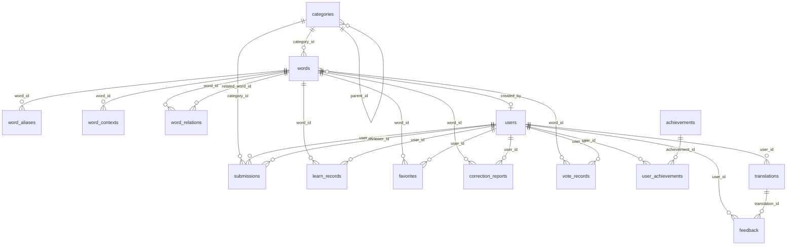

#### 4.4.3 categories（分类表）

**说明：** 词条分类表，支持自引用三级层级结构（如：直播电商 > 带货话术 > 逼单话术）。

| 字段名 | 类型 | 约束 | 默认值 | 说明 |
|---|---|---|---|---|
| id | INTEGER | PK, AUTOINCREMENT | | 主键 |
| name | VARCHAR(50) | NOT NULL | | 分类名称 |
| parent_id | INTEGER | FK(categories.id), NULL | NULL | 父分类 ID，一级分类为 NULL |
| level | TINYINT | NOT NULL | 1 | 层级：1/2/3 |
| sort_order | INTEGER | NOT NULL | 0 | 排序权重，升序 |
| icon | VARCHAR(255) | NULL | NULL | 分类图标 URL 或标识 |
| created_at | DATETIME | NOT NULL | CURRENT_TIMESTAMP | 创建时间 |
| updated_at | DATETIME | NOT NULL | CURRENT_TIMESTAMP | 更新时间 |

**索引：**
- idx_categories_parent_id：parent_id 字段索引，加速层级查询
- idx_categories_level：level 字段索引，加速按层级筛选
- idx_categories_sort：level + sort_order 联合索引，加速层级内排序展示

#### 4.4.4 words（词条表）

**说明：** 词条主表，存储热词及其释义、风险等级、来源、状态等核心信息，是系统数据中枢。采用软删除策略。

| 字段名 | 类型 | 约束 | 默认值 | 说明 |
|---|---|---|---|---|
| id | INTEGER | PK, AUTOINCREMENT | | 主键 |
| word | VARCHAR(100) | NOT NULL | | 词条名称 |
| pinyin | VARCHAR(100) | NULL | NULL | 拼音 |
| meaning | TEXT | NOT NULL | | 释义 |
| example | TEXT | NULL | NULL | 示例语境 |
| category_id | INTEGER | FK(categories.id), NOT NULL | | 所属分类 |
| risk_level | VARCHAR(10) | NOT NULL | 'low' | 风险等级：low/medium/high |
| risk_types | JSON | NULL | NULL | 风险类型数组，如 ["法律","舆情"] |
| risk_advice | TEXT | NULL | NULL | 使用建议 |
| source | VARCHAR(10) | NOT NULL | 'database' | 来源：database/manual/ai |
| status | VARCHAR(10) | NOT NULL | 'pending' | 状态：pending/approved/rejected/published |
| confidence | VARCHAR(10) | NULL | NULL | 置信度：high/medium/low（AI 生成时记录） |
| view_count | INTEGER | NOT NULL | 0 | 浏览次数 |
| vote_count | INTEGER | NOT NULL | 0 | 投票净分（赞 - 踩） |
| created_by | INTEGER | FK(users.id), NULL | NULL | 创建者（manual/ai 时记录） |
| created_at | DATETIME | NOT NULL | CURRENT_TIMESTAMP | 创建时间 |
| updated_at | DATETIME | NOT NULL | CURRENT_TIMESTAMP | 更新时间 |
| deleted_at | DATETIME | NULL | NULL | 软删除时间，NULL 表示未删除 |

**索引：**
- idx_words_category_id：category_id 字段索引，加速分类查询
- idx_words_status：status 字段索引，加速按状态筛选
- idx_words_risk_level：risk_level 字段索引，加速风险过滤
- idx_words_word：word 字段索引，加速搜索与唯一性校验
- idx_words_source：source 字段索引，加速按来源统计
- idx_words_created_at：created_at 字段索引，加速时间排序
- idx_words_vote_count：vote_count 字段索引，加速热门排序

#### 4.4.5 word_aliases（词条别名表）

**说明：** 存储词条的别名或同义表达，用于搜索匹配与联想推荐。

| 字段名 | 类型 | 约束 | 默认值 | 说明 |
|---|---|---|---|---|
| id | INTEGER | PK, AUTOINCREMENT | | 主键 |
| word_id | INTEGER | FK(words.id), NOT NULL | | 所属词条 |
| alias | VARCHAR(100) | NOT NULL | | 别名 |
| created_at | DATETIME | NOT NULL | CURRENT_TIMESTAMP | 创建时间 |

**索引：**
- idx_word_aliases_word_id：word_id 字段索引，加速按词条查别名
- idx_word_aliases_alias：alias 字段索引，加速搜索匹配

#### 4.4.6 word_contexts（多语境表）

**说明：** 存储词条在不同场景下的释义，如直播电商、投资圈、游戏圈、日常等，支持一词多义展示。

| 字段名 | 类型 | 约束 | 默认值 | 说明 |
|---|---|---|---|---|
| id | INTEGER | PK, AUTOINCREMENT | | 主键 |
| word_id | INTEGER | FK(words.id), NOT NULL | | 所属词条 |
| context_name | VARCHAR(50) | NOT NULL | | 语境名称：直播电商/投资圈/游戏圈/日常等 |
| meaning | TEXT | NOT NULL | | 该语境下的释义 |
| sort_order | INTEGER | NOT NULL | 0 | 展示排序权重 |

**索引：**
- idx_word_contexts_word_id：word_id 字段索引，加速按词条查语境

#### 4.4.7 word_relations（词条关系表）

**说明：** 建立词条之间的关联关系，支持同义词、相关词、反义词展示。

| 字段名 | 类型 | 约束 | 默认值 | 说明 |
|---|---|---|---|---|
| id | INTEGER | PK, AUTOINCREMENT | | 主键 |
| word_id | INTEGER | FK(words.id), NOT NULL | | 词条 A |
| related_word_id | INTEGER | FK(words.id), NOT NULL | | 关联词条 B |
| relation_type | VARCHAR(10) | NOT NULL | | 关系类型：synonym/related/antonym |

**索引：**
- idx_word_relations_word_id：word_id 字段索引，加速正向关系查询
- idx_word_relations_related：related_word_id 字段索引，加速反向关系查询
- uk_word_relations：word_id + related_word_id + relation_type 唯一约束，防止重复关系

#### 4.4.8 users（用户表）

**说明：** 用户主表，存储账号信息、游戏化属性与个性化偏好，支持账号登录与设备登录两种方式。

| 字段名 | 类型 | 约束 | 默认值 | 说明 |
|---|---|---|---|---|
| id | INTEGER | PK, AUTOINCREMENT | | 主键 |
| username | VARCHAR(50) | NOT NULL, UNIQUE | | 登录用户名 |
| nickname | VARCHAR(50) | NULL | NULL | 昵称 |
| password_hash | VARCHAR(255) | NULL | NULL | 密码哈希（设备登录可空） |
| email | VARCHAR(100) | NULL, UNIQUE | NULL | 邮箱 |
| device_id | VARCHAR(255) | NULL, UNIQUE | NULL | 设备 ID（游客/设备登录） |
| avatar | VARCHAR(255) | NULL | NULL | 头像 URL |
| experience | INTEGER | NOT NULL | 0 | 经验值 |
| level | INTEGER | NOT NULL | 1 | 用户等级 |
| title | VARCHAR(50) | NULL | NULL | 称号 |
| preferences | JSON | NULL | NULL | 偏好设置，如主题、关注分类 |
| created_at | DATETIME | NOT NULL | CURRENT_TIMESTAMP | 创建时间 |
| updated_at | DATETIME | NOT NULL | CURRENT_TIMESTAMP | 更新时间 |
| last_login_at | DATETIME | NULL | NULL | 最后登录时间 |

**索引：**
- idx_users_username：username 唯一索引
- idx_users_email：email 唯一索引
- idx_users_device_id：device_id 唯一索引
- idx_users_level：level 字段索引，加速等级查询

#### 4.4.9 learn_records（学习记录表）

**说明：** 记录用户对词条的学习状态，支持学习进度统计与复习推荐。

| 字段名 | 类型 | 约束 | 默认值 | 说明 |
|---|---|---|---|---|
| id | INTEGER | PK, AUTOINCREMENT | | 主键 |
| user_id | INTEGER | FK(users.id), NOT NULL | | 用户 |
| word_id | INTEGER | FK(words.id), NOT NULL | | 词条 |
| status | VARCHAR(15) | NOT NULL | 'learned' | 状态：learned/mastered/unmastered |
| learned_at | DATETIME | NOT NULL | CURRENT_TIMESTAMP | 学习时间 |

**索引：**
- idx_learn_records_user_id：user_id 字段索引
- idx_learn_records_word_id：word_id 字段索引
- uk_learn_records_user_word：user_id + word_id 唯一约束，防止重复记录

#### 4.4.10 favorites（收藏表）

**说明：** 用户收藏的词条列表。

| 字段名 | 类型 | 约束 | 默认值 | 说明 |
|---|---|---|---|---|
| id | INTEGER | PK, AUTOINCREMENT | | 主键 |
| user_id | INTEGER | FK(users.id), NOT NULL | | 用户 |
| word_id | INTEGER | FK(words.id), NOT NULL | | 词条 |
| created_at | DATETIME | NOT NULL | CURRENT_TIMESTAMP | 收藏时间 |

**索引：**
- idx_favorites_user_id：user_id 字段索引
- uk_favorites_user_word：user_id + word_id 唯一约束，防止重复收藏

#### 4.4.11 translations（翻译历史表）

**说明：** 记录用户的翻译历史，支持结果回溯与质量反馈关联。

| 字段名 | 类型 | 约束 | 默认值 | 说明 |
|---|---|---|---|---|
| id | INTEGER | PK, AUTOINCREMENT | | 主键 |
| user_id | INTEGER | FK(users.id), NULL | NULL | 用户（游客可空） |
| original_text | TEXT | NOT NULL | | 原文 |
| result | JSON | NOT NULL | | 翻译结果，含释义、风险、建议等 |
| mode | VARCHAR(10) | NOT NULL | 'translate' | 模式：dict/translate |
| created_at | DATETIME | NOT NULL | CURRENT_TIMESTAMP | 创建时间 |

**索引：**
- idx_translations_user_id：user_id 字段索引
- idx_translations_created_at：created_at 字段索引，加速时间排序

#### 4.4.12 submissions（用户提交表）

**说明：** 用户提交的新词条，经审核通过后可生成正式 words 记录。

| 字段名 | 类型 | 约束 | 默认值 | 说明 |
|---|---|---|---|---|
| id | INTEGER | PK, AUTOINCREMENT | | 主键 |
| user_id | INTEGER | FK(users.id), NOT NULL | | 提交者 |
| word | VARCHAR(100) | NOT NULL | | 词条名称 |
| meaning | TEXT | NOT NULL | | 释义 |
| example | TEXT | NULL | NULL | 示例 |
| category_id | INTEGER | FK(categories.id), NOT NULL | | 建议分类 |
| status | VARCHAR(10) | NOT NULL | 'pending' | 状态：pending/approved/rejected |
| vote_count | INTEGER | NOT NULL | 0 | 投票数 |
| reviewer_id | INTEGER | FK(users.id), NULL | NULL | 审核人 |
| reviewed_at | DATETIME | NULL | NULL | 审核时间 |
| created_at | DATETIME | NOT NULL | CURRENT_TIMESTAMP | 提交时间 |

**索引：**
- idx_submissions_user_id：user_id 字段索引
- idx_submissions_status：status 字段索引，加速审核队列
- idx_submissions_category_id：category_id 字段索引
- idx_submissions_vote_count：vote_count 字段索引，加速热门排序

#### 4.4.13 correction_reports（纠错表）

**说明：** 用户对已有词条发起的纠错报告，覆盖释义错误、示例不当、内容过时等场景。

| 字段名 | 类型 | 约束 | 默认值 | 说明 |
|---|---|---|---|---|
| id | INTEGER | PK, AUTOINCREMENT | | 主键 |
| word_id | INTEGER | FK(words.id), NOT NULL | | 被纠错词条 |
| user_id | INTEGER | FK(users.id), NOT NULL | | 提交者 |
| type | VARCHAR(20) | NOT NULL | | 类型：meaning_wrong/example_wrong/outdated/other |
| content | TEXT | NOT NULL | | 纠错内容说明 |
| status | VARCHAR(10) | NOT NULL | 'pending' | 状态：pending/approved/rejected |
| created_at | DATETIME | NOT NULL | CURRENT_TIMESTAMP | 提交时间 |

**索引：**
- idx_correction_reports_word_id：word_id 字段索引
- idx_correction_reports_user_id：user_id 字段索引
- idx_correction_reports_status：status 字段索引，加速审核队列

#### 4.4.14 feedback（质量反馈表）

**说明：** 用户对翻译结果的质量反馈，用于 AI 翻译质量评估与模型优化。

| 字段名 | 类型 | 约束 | 默认值 | 说明 |
|---|---|---|---|---|
| id | INTEGER | PK, AUTOINCREMENT | | 主键 |
| translation_id | INTEGER | FK(translations.id), NOT NULL | | 关联翻译记录 |
| user_id | INTEGER | FK(users.id), NULL | NULL | 用户（游客可空） |
| device_id | VARCHAR(255) | NULL | NULL | 设备 ID，用于防刷 |
| type | VARCHAR(15) | NOT NULL | | 类型：accurate/inaccurate/outdated |
| comment | TEXT | NULL | NULL | 补充说明 |
| created_at | DATETIME | NOT NULL | CURRENT_TIMESTAMP | 提交时间 |

**索引：**
- idx_feedback_translation_id：translation_id 字段索引
- idx_feedback_user_id：user_id 字段索引
- idx_feedback_type：type 字段索引，加速质量统计

#### 4.4.15 achievements（成就表）

**说明：** 成就配置表，定义称号与徽章的解锁条件及奖励经验值。

| 字段名 | 类型 | 约束 | 默认值 | 说明 |
|---|---|---|---|---|
| id | INTEGER | PK, AUTOINCREMENT | | 主键 |
| name | VARCHAR(50) | NOT NULL, UNIQUE | | 成就名称 |
| description | VARCHAR(255) | NOT NULL | | 成就描述 |
| type | VARCHAR(10) | NOT NULL | | 类型：title/badge |
| icon | VARCHAR(255) | NULL | NULL | 图标 URL 或标识 |
| condition | JSON | NOT NULL | | 解锁条件，如 {"learn_count": 10} |
| experience_reward | INTEGER | NOT NULL | 0 | 解锁奖励经验值 |

**索引：**
- idx_achievements_name：name 唯一索引
- idx_achievements_type：type 字段索引，加速按类型查询

#### 4.4.16 user_achievements（用户成就关联表）

**说明：** 用户已解锁的成就记录。

| 字段名 | 类型 | 约束 | 默认值 | 说明 |
|---|---|---|---|---|
| id | INTEGER | PK, AUTOINCREMENT | | 主键 |
| user_id | INTEGER | FK(users.id), NOT NULL | | 用户 |
| achievement_id | INTEGER | FK(achievements.id), NOT NULL | | 成就 |
| unlocked_at | DATETIME | NOT NULL | CURRENT_TIMESTAMP | 解锁时间 |

**索引：**
- idx_user_achievements_user_id：user_id 字段索引
- idx_user_achievements_achievement_id：achievement_id 字段索引
- uk_user_achievements：user_id + achievement_id 唯一约束，防止重复解锁

#### 4.4.17 vote_records（投票记录表）

**说明：** 用户对词条的投票记录，支撑 words.vote_count 统计与防重复投票。

| 字段名 | 类型 | 约束 | 默认值 | 说明 |
|---|---|---|---|---|
| id | INTEGER | PK, AUTOINCREMENT | | 主键 |
| user_id | INTEGER | FK(users.id), NOT NULL | | 投票用户 |
| word_id | INTEGER | FK(words.id), NOT NULL | | 被投票词条 |
| vote_type | VARCHAR(10) | NOT NULL | | 投票类型：upvote/downvote |
| created_at | DATETIME | NOT NULL | CURRENT_TIMESTAMP | 投票时间 |

**索引：**
- idx_vote_records_user_id：user_id 字段索引
- idx_vote_records_word_id：word_id 字段索引
- uk_vote_records_user_word：user_id + word_id 唯一约束，防止重复投票

#### 4.4.18 索引设计总览

下表汇总全部索引及其用途，便于性能调优与维护参考。索引命名规范：`idx_` 前缀为普通索引，`uk_` 前缀为唯一索引/约束。

| 索引名 | 所属表 | 字段 | 类型 | 用途 |
|---|---|---|---|---|
| idx_categories_parent_id | categories | parent_id | 普通 | 层级查询 |
| idx_categories_level | categories | level | 普通 | 按层级筛选 |
| idx_categories_sort | categories | level, sort_order | 联合 | 层级内排序展示 |
| idx_words_category_id | words | category_id | 普通 | 分类查询 |
| idx_words_status | words | status | 普通 | 状态筛选 |
| idx_words_risk_level | words | risk_level | 普通 | 风险过滤 |
| idx_words_word | words | word | 普通 | 搜索与唯一校验 |
| idx_words_source | words | source | 普通 | 来源统计 |
| idx_words_created_at | words | created_at | 普通 | 时间排序 |
| idx_words_vote_count | words | vote_count | 普通 | 热门排序 |
| idx_word_aliases_word_id | word_aliases | word_id | 普通 | 按词条查别名 |
| idx_word_aliases_alias | word_aliases | alias | 普通 | 搜索匹配 |
| idx_word_contexts_word_id | word_contexts | word_id | 普通 | 按词条查语境 |
| idx_word_relations_word_id | word_relations | word_id | 普通 | 正向关系查询 |
| idx_word_relations_related | word_relations | related_word_id | 普通 | 反向关系查询 |
| uk_word_relations | word_relations | word_id, related_word_id, relation_type | 唯一 | 防止重复关系 |
| idx_users_username | users | username | 唯一 | 登录校验 |
| idx_users_email | users | email | 唯一 | 邮箱唯一 |
| idx_users_device_id | users | device_id | 唯一 | 设备登录 |
| idx_users_level | users | level | 普通 | 等级查询 |
| idx_learn_records_user_id | learn_records | user_id | 普通 | 用户学习记录 |
| idx_learn_records_word_id | learn_records | word_id | 普通 | 词条学习统计 |
| uk_learn_records_user_word | learn_records | user_id, word_id | 唯一 | 防止重复记录 |
| idx_favorites_user_id | favorites | user_id | 普通 | 用户收藏列表 |
| uk_favorites_user_word | favorites | user_id, word_id | 唯一 | 防止重复收藏 |
| idx_translations_user_id | translations | user_id | 普通 | 用户翻译历史 |
| idx_translations_created_at | translations | created_at | 普通 | 时间排序 |
| idx_submissions_user_id | submissions | user_id | 普通 | 用户提交记录 |
| idx_submissions_status | submissions | status | 普通 | 审核队列 |
| idx_submissions_category_id | submissions | category_id | 普通 | 分类统计 |
| idx_submissions_vote_count | submissions | vote_count | 普通 | 热门排序 |
| idx_correction_reports_word_id | correction_reports | word_id | 普通 | 词条纠错列表 |
| idx_correction_reports_user_id | correction_reports | user_id | 普通 | 用户纠错记录 |
| idx_correction_reports_status | correction_reports | status | 普通 | 审核队列 |
| idx_feedback_translation_id | feedback | translation_id | 普通 | 翻译反馈关联 |
| idx_feedback_user_id | feedback | user_id | 普通 | 用户反馈记录 |
| idx_feedback_type | feedback | type | 普通 | 质量统计 |
| idx_achievements_name | achievements | name | 唯一 | 成就唯一 |
| idx_achievements_type | achievements | type | 普通 | 按类型查询 |
| idx_user_achievements_user_id | user_achievements | user_id | 普通 | 用户成就列表 |
| idx_user_achievements_achievement_id | user_achievements | achievement_id | 普通 | 成就解锁统计 |
| uk_user_achievements | user_achievements | user_id, achievement_id | 唯一 | 防止重复解锁 |
| idx_vote_records_user_id | vote_records | user_id | 普通 | 用户投票记录 |
| idx_vote_records_word_id | vote_records | word_id | 普通 | 词条投票统计 |
| uk_vote_records_user_word | vote_records | user_id, word_id | 唯一 | 防止重复投票 |

#### 4.4.19 初始数据说明

系统首次部署时需预置以下初始数据，确保核心功能开箱可用。初始数据通过数据库迁移脚本（seed）写入，可重复执行且幂等。

**1. 一级分类（12 个）**

预置 12 个一级分类，覆盖核心使用场景，sort_order 按 10 递增便于后续插入：

| sort_order | name | icon | 说明 |
|---|---|---|---|
| 10 | 职场黑话 | workplace | 职场用语 |
| 20 | 直播电商 | live | 直播带货话术 |
| 30 | 投资理财 | finance | 投资圈术语 |
| 40 | 游戏电竞 | game | 游戏圈黑话 |
| 50 | 互联网 | internet | 互联网行业术语 |
| 60 | 饭圈娱乐 | fan | 娱乐圈用语 |
| 70 | 校园教育 | campus | 校园用语 |
| 80 | 网络梗 | meme | 网络流行梗 |
| 90 | 方言俚语 | dialect | 各地方言 |
| 100 | 科技 AI | tech | 科技领域术语 |
| 110 | 商业财经 | business | 商业财经术语 |
| 120 | 日常生活 | daily | 日常用语 |

**2. 预置测试用户**

预置一个管理员账号与若干测试账号，便于初始化后立即进行功能验证：

| username | nickname | level | 说明 |
|---|---|---|---|
| admin | 管理员 | 99 | 系统管理员，可审核内容 |
| tester01 | 测试用户01 | 1 | 普通用户测试账号 |
| tester02 | 测试用户02 | 1 | 普通用户测试账号 |

密码均使用 bcrypt 哈希存储，初始密码见部署文档（敏感信息不写入迁移脚本明文）。

**3. 初始成就配置**

预置成就体系初始数据，覆盖学习、互动、贡献三大维度：

| name | type | condition | experience_reward | 说明 |
|---|---|---|---|---|
| 初窥门径 | title | {"learn_count": 1} | 10 | 学习首个词条 |
| 小有所成 | badge | {"learn_count": 10} | 50 | 学习 10 个词条 |
| 博学多识 | title | {"learn_count": 50} | 200 | 学习 50 个词条 |
| 热词达人 | title | {"learn_count": 100} | 500 | 学习 100 个词条 |
| 收藏家 | badge | {"favorite_count": 20} | 100 | 收藏 20 个词条 |
| 贡献者 | badge | {"submit_count": 1} | 30 | 首次提交词条 |
| 优质贡献者 | title | {"submit_approved": 5} | 200 | 5 个提交通过审核 |
| 纠错先锋 | badge | {"correction_count": 3} | 80 | 提交 3 次纠错 |
| 翻译达人 | badge | {"translate_count": 50} | 100 | 翻译 50 次 |
| 资深用户 | title | {"login_days": 30} | 300 | 累计登录 30 天 |

**4. 其他初始数据约定**

- **系统配置：** 在应用配置层预置默认风险等级阈值、限流参数、AI 翻译提示词模板等，不单独建表。
- **示例词条：** 可选预置少量（建议 20-50 条）已发布（status=published）的示例词条，便于首次启动后立即体验搜索、翻译、学习等功能。
- **软删除约定：** words 表采用软删除（deleted_at），初始数据该字段均置 NULL。
- **时间字段约定：** 所有 created_at / updated_at 默认值为 CURRENT_TIMESTAMP，由数据库层自动填充。

### 4.5 接口设计

本节定义系统前后端之间全部 RESTful API 接口。所有接口均返回统一响应格式，认证类接口需在请求头携带 JWT Token。

#### 4.5.1 统一响应格式

所有接口响应均采用如下统一 JSON 结构：

```json
{
  "code": 200,
  "message": "success",
  "data": { ... }
}
```

| 字段 | 类型 | 说明 |
|---|---|---|
| code | int | 业务状态码，200 表示成功，其他表示错误 |
| message | string | 状态描述信息 |
| data | object/array | 业务数据，错误时为 null |

**错误码定义：**

| 错误码 | 含义 | 触发场景 |
|---|---|---|
| 200 | 成功 | 请求处理成功 |
| 400 | 参数错误 | 请求参数缺失或格式不合法 |
| 401 | 未认证 | 缺少 Token 或 Token 失效 |
| 403 | 无权限 | 已认证但无访问权限 |
| 404 | 资源不存在 | 路径或资源 ID 无效 |
| 409 | 资源冲突 | 唯一约束冲突（如重复注册） |
| 422 | 业务校验失败 | 参数格式正确但业务规则不通过 |
| 429 | 请求过于频繁 | 触发限流 |
| 500 | 服务器内部错误 | 后端异常 |
| 503 | 服务不可用 | 维护中或依赖服务不可用 |

#### 4.5.2 认证方案

系统采用 JWT（JSON Web Token）进行身份认证。

**认证流程：**

1. 客户端调用 `POST /api/user/register` 或 `POST /api/user/login` 获取 Token
2. 后端校验账号合法性，签发 JWT，返回 `token` 与 `expires_in`
3. 客户端将 Token 存储于本地，后续请求在请求头携带：
   ```
   Authorization: Bearer <token>
   ```
4. 后端中间件解析并校验 Token，失败返回 401

**Token 规则：**

- 算法：HS256
- 有效期：7 天
- 载荷（Payload）字段：`user_id`、`device_id`、`iat`、`exp`
- 续期策略：客户端在 Token 过期前 24 小时内调用任意认证接口可触发静默续期

#### 4.5.3 翻译接口

**1. POST /api/translate —— 中译中翻译**

| 项 | 说明 |
|---|---|
| 路径 | `/api/translate` |
| 方法 | POST |
| 认证 | 可选（已认证用户可触发反馈开关） |
| Content-Type | application/json |

**请求体：**

```json
{
  "text": "今天天气真好",
  "mode": "translate"
}
```

| 字段 | 类型 | 必填 | 说明 |
|---|---|---|---|
| text | string | 是 | 待翻译原文，长度 1-500 |
| mode | string | 否 | 翻译模式：`translate`（默认，中译中）/ `dict`（词典匹配） |

**响应体示例：**

```json
{
  "code": 200,
  "message": "success",
  "data": {
    "translation": "今日天朗气清，惠风和畅",
    "keywords": [
      {
        "source": "天气",
        "confidence": 0.92,
        "classification": "natural_phenomenon"
      },
      {
        "source": "真好",
        "confidence": 0.85,
        "classification": "emotion_positive"
      }
    ],
    "context": "用于描述令人愉悦的白日天气，多见于口语对话。",
    "subtext": "隐含对当下环境的欣赏与轻松情绪。",
    "suggestion": "可在书面表达中替换为「天朗气清」「风和日丽」。",
    "suggested_reply": "是啊，确实是个出门走走的好日子。",
    "risk": {
      "risk_level": "low",
      "risk_types": [],
      "advice": "无风险提示。"
    },
    "related": [
      { "id": 1024, "word": "风和日丽", "similarity": 0.88 },
      { "id": 2048, "word": "秋高气爽", "similarity": 0.76 }
    ],
    "feedback_enabled": true
  }
}
```

| 字段 | 类型 | 说明 |
|---|---|---|
| data.translation | string | 翻译结果 |
| data.keywords | array | 关键词命中列表 |
| data.keywords[].source | string | 命中的原文片段 |
| data.keywords[].confidence | float | 命中置信度 0-1 |
| data.keywords[].classification | string | 语义分类标签 |
| data.context | string | 语境说明 |
| data.subtext | string | 潜台词解析 |
| data.suggestion | string | 表达建议 |
| data.suggested_reply | string | 推荐回复语 |
| data.risk | object | 风险评估结果 |
| data.risk.risk_level | string | 风险等级：`low`/`medium`/`high` |
| data.risk.risk_types | array | 风险类型枚举列表 |
| data.risk.advice | string | 应对建议 |
| data.related | array | 相关词条列表 |
| data.feedback_enabled | bool | 是否允许提交质量反馈 |

**主要错误码：** 400（text 为空或超长）、422（mode 取值非法）、429（触发翻译限流）、500（模型服务异常）

---

**2. POST /api/translate/dict —— 词典模式匹配**

| 项 | 说明 |
|---|---|
| 路径 | `/api/translate/dict` |
| 方法 | POST |
| 认证 | 否 |
| Content-Type | application/json |

**请求体：**

```json
{
  "text": "摆烂"
}
```

**响应体示例：**

```json
{
  "code": 200,
  "message": "success",
  "data": {
    "hits": [
      {
        "id": 3072,
        "word": "摆烂",
        "pinyin": "bǎi làn",
        "definition": "指主动放弃努力、任由事态恶化的态度或行为。",
        "tags": ["网络流行语", "消极态度"],
        "match_score": 1.0
      }
    ],
    "total": 1
  }
}
```

**主要错误码：** 400（text 为空）、404（未命中任何词条）

#### 4.5.4 词条接口

**3. GET /api/words —— 词条列表**

| 项 | 说明 |
|---|---|
| 路径 | `/api/words` |
| 方法 | GET |
| 认证 | 否 |

**查询参数：**

| 参数 | 类型 | 必填 | 说明 |
|---|---|---|---|
| page | int | 否 | 页码，默认 1 |
| page_size | int | 否 | 每页数量，默认 20，最大 100 |
| category_id | int | 否 | 按分类筛选 |
| tag | string | 否 | 按标签筛选 |
| sort | string | 否 | 排序字段：`hot`（默认）/`new`/`name` |

**响应体示例：**

```json
{
  "code": 200,
  "message": "success",
  "data": {
    "list": [
      {
        "id": 3072,
        "word": "摆烂",
        "pinyin": "bǎi làn",
        "summary": "指主动放弃努力、任由事态恶化的态度或行为。",
        "category": { "id": 8, "name": "网络流行语" },
        "tags": ["消极态度"],
        "view_count": 12893,
        "favorite_count": 412,
        "created_at": "2025-09-01T10:23:00Z"
      }
    ],
    "total": 1280,
    "page": 1,
    "page_size": 20
  }
}
```

**主要错误码：** 400（参数非法）、429（触发限流）

---

**4. GET /api/words/{id} —— 词条详情**

| 项 | 说明 |
|---|---|
| 路径 | `/api/words/{id}` |
| 方法 | GET |
| 认证 | 否 |

**路径参数：**

| 参数 | 类型 | 说明 |
|---|---|---|
| id | int | 词条 ID |

**响应体示例：**

```json
{
  "code": 200,
  "message": "success",
  "data": {
    "id": 3072,
    "word": "摆烂",
    "pinyin": "bǎi làn",
    "definition": "指主动放弃努力、任由事态恶化的态度或行为。",
    "contexts": [
      { "scene": "职场", "example": "这项目又拖了三个月，我打算直接摆烂。" },
      { "scene": "学习", "example": "复习不完了，干脆摆烂去打游戏。" }
    ],
    "aliases": ["躺平", "放弃治疗"],
    "related": [
      { "id": 3090, "word": "躺平", "relation": "synonym" }
    ],
    "category": { "id": 8, "name": "网络流行语" },
    "tags": ["消极态度", "网络流行语"],
    "risk_level": "low",
    "view_count": 12893,
    "favorite_count": 412,
    "is_favorited": false,
    "created_at": "2025-09-01T10:23:00Z",
    "updated_at": "2025-10-12T08:00:00Z"
  }
}
```

**主要错误码：** 404（词条不存在）

---

**5. GET /api/words/search —— 搜索词条**

| 项 | 说明 |
|---|---|
| 路径 | `/api/words/search` |
| 方法 | GET |
| 认证 | 否 |

**查询参数：**

| 参数 | 类型 | 必填 | 说明 |
|---|---|---|---|
| keyword | string | 是 | 搜索关键词，长度 1-50 |
| page | int | 否 | 页码，默认 1 |
| page_size | int | 否 | 每页数量，默认 20 |

**响应体示例：**

```json
{
  "code": 200,
  "message": "success",
  "data": {
    "list": [
      {
        "id": 3072,
        "word": "摆烂",
        "summary": "指主动放弃努力、任由事态恶化的态度或行为。",
        "highlight": "<em>摆烂</em>",
        "match_score": 0.98
      }
    ],
    "total": 5,
    "page": 1,
    "page_size": 20
  }
}
```

**主要错误码：** 400（keyword 为空）、429（搜索限流）

---

**6. POST /api/words/{id}/favorite —— 收藏词条**

| 项 | 说明 |
|---|---|
| 路径 | `/api/words/{id}/favorite` |
| 方法 | POST |
| 认证 | 是 |

**路径参数：** `id`（int，词条 ID）

**请求体：** 无

**响应体示例：**

```json
{
  "code": 200,
  "message": "success",
  "data": {
    "word_id": 3072,
    "is_favorited": true,
    "favorite_count": 413
  }
}
```

**主要错误码：** 401（未认证）、404（词条不存在）、409（已收藏）

---

**7. DELETE /api/words/{id}/favorite —— 取消收藏**

| 项 | 说明 |
|---|---|
| 路径 | `/api/words/{id}/favorite` |
| 方法 | DELETE |
| 认证 | 是 |

**路径参数：** `id`（int，词条 ID）

**响应体示例：**

```json
{
  "code": 200,
  "message": "success",
  "data": {
    "word_id": 3072,
    "is_favorited": false,
    "favorite_count": 412
  }
}
```

**主要错误码：** 401（未认证）、404（词条或收藏记录不存在）

#### 4.5.5 分类接口

**8. GET /api/categories —— 分类树**

| 项 | 说明 |
|---|---|
| 路径 | `/api/categories` |
| 方法 | GET |
| 认证 | 否 |

**响应体示例：**

```json
{
  "code": 200,
  "message": "success",
  "data": [
    {
      "id": 1,
      "name": "日常表达",
      "icon": "daily",
      "children": [
        { "id": 11, "name": "问候", "icon": "greet", "word_count": 86 },
        { "id": 12, "name": "餐饮", "icon": "food", "word_count": 152 }
      ]
    },
    {
      "id": 8,
      "name": "网络流行语",
      "icon": "internet",
      "word_count": 320
    }
  ]
}
```

**主要错误码：** 500（分类加载失败）

---

**9. GET /api/categories/{id}/words —— 分类下词条**

| 项 | 说明 |
|---|---|
| 路径 | `/api/categories/{id}/words` |
| 方法 | GET |
| 认证 | 否 |

**路径参数：** `id`（int，分类 ID）

**查询参数：**

| 参数 | 类型 | 必填 | 说明 |
|---|---|---|---|
| page | int | 否 | 页码，默认 1 |
| page_size | int | 否 | 每页数量，默认 20 |
| sort | string | 否 | 排序：`hot`/`new`/`name` |

**响应体示例：**

```json
{
  "code": 200,
  "message": "success",
  "data": {
    "category": { "id": 8, "name": "网络流行语" },
    "list": [
      { "id": 3072, "word": "摆烂", "summary": "指主动放弃努力……" }
    ],
    "total": 320,
    "page": 1,
    "page_size": 20
  }
}
```

**主要错误码：** 404（分类不存在）

#### 4.5.6 用户接口

**10. POST /api/user/register —— 用户注册**

| 项 | 说明 |
|---|---|
| 路径 | `/api/user/register` |
| 方法 | POST |
| 认证 | 否 |
| Content-Type | application/json |

**请求体：**

```json
{
  "device_id": "A1B2C3D4-XXXX-XXXX-XXXX",
  "nickname": "小明"
}
```

| 字段 | 类型 | 必填 | 说明 |
|---|---|---|---|
| device_id | string | 是 | 设备唯一标识 |
| nickname | string | 否 | 昵称，默认「匿名用户」 |

**响应体示例：**

```json
{
  "code": 200,
  "message": "success",
  "data": {
    "user_id": 50001,
    "token": "eyJhbGciOiJIUzI1NiIsInR5cCI6IkpXVCJ9...",
    "expires_in": 604800
  }
}
```

**主要错误码：** 400（device_id 为空）、409（设备已注册）

---

**11. POST /api/user/login —— 用户登录**

| 项 | 说明 |
|---|---|
| 路径 | `/api/user/login` |
| 方法 | POST |
| 认证 | 否 |
| Content-Type | application/json |

**请求体：**

```json
{
  "device_id": "A1B2C3D4-XXXX-XXXX-XXXX"
}
```

**响应体示例：**

```json
{
  "code": 200,
  "message": "success",
  "data": {
    "user_id": 50001,
    "token": "eyJhbGciOiJIUzI1NiIsInR5cCI6IkpXVCJ9...",
    "expires_in": 604800
  }
}
```

**主要错误码：** 400（device_id 为空）、404（用户不存在）

---

**12. GET /api/user/profile —— 用户信息**

| 项 | 说明 |
|---|---|
| 路径 | `/api/user/profile` |
| 方法 | GET |
| 认证 | 是 |

**响应体示例：**

```json
{
  "code": 200,
  "message": "success",
  "data": {
    "user_id": 50001,
    "nickname": "小明",
    "avatar": "https://cdn.example.com/u/50001.png",
    "level": 6,
    "title": "词海漫游者",
    "exp": 1280,
    "next_level_exp": 2000,
    "favorite_count": 42,
    "submission_count": 3,
    "achievement_count": 12,
    "registered_at": "2025-08-01T09:00:00Z"
  }
}
```

**主要错误码：** 401（未认证）

---

**13. PUT /api/user/preferences —— 更新偏好设置**

| 项 | 说明 |
|---|---|
| 路径 | `/api/user/preferences` |
| 方法 | PUT |
| 认证 | 是 |
| Content-Type | application/json |

**请求体：**

```json
{
  "default_mode": "translate",
  "show_risk_advice": true,
  "font_size": "medium",
  "theme": "auto"
}
```

| 字段 | 类型 | 必填 | 说明 |
|---|---|---|---|
| default_mode | string | 否 | 默认翻译模式：`translate`/`dict` |
| show_risk_advice | bool | 否 | 是否显示风险提示 |
| font_size | string | 否 | 字号：`small`/`medium`/`large` |
| theme | string | 否 | 主题：`light`/`dark`/`auto` |

**响应体示例：**

```json
{
  "code": 200,
  "message": "success",
  "data": {
    "default_mode": "translate",
    "show_risk_advice": true,
    "font_size": "medium",
    "theme": "auto",
    "updated_at": "2025-11-01T12:00:00Z"
  }
}
```

**主要错误码：** 401（未认证）、422（取值非法）

#### 4.5.7 热词接口

**14. GET /api/hot/daily —— 每日热词**

| 项 | 说明 |
|---|---|
| 路径 | `/api/hot/daily` |
| 方法 | GET |
| 认证 | 否 |

**响应体示例：**

```json
{
  "code": 200,
  "message": "success",
  "data": {
    "date": "2025-11-01",
    "list": [
      { "rank": 1, "id": 3072, "word": "摆烂", "heat": 9821, "vote_count": 412 },
      { "rank": 2, "id": 3090, "word": "躺平", "heat": 8740, "vote_count": 388 }
    ]
  }
}
```

**说明：** 列表固定返回 10 条。

**主要错误码：** 500（数据加载失败）

---

**15. POST /api/hot/{word_id}/vote —— 热词投票**

| 项 | 说明 |
|---|---|
| 路径 | `/api/hot/{word_id}/vote` |
| 方法 | POST |
| 认证 | 是 |

**路径参数：** `word_id`（int，词条 ID）

**请求体：** 无

**响应体示例：**

```json
{
  "code": 200,
  "message": "success",
  "data": {
    "word_id": 3072,
    "vote_count": 413,
    "has_voted": true
  }
}
```

**主要错误码：** 401（未认证）、404（词条不存在）、409（今日已投票）

---

**16. GET /api/hot/ranking —— 热词排行榜**

| 项 | 说明 |
|---|---|
| 路径 | `/api/hot/ranking` |
| 方法 | GET |
| 认证 | 否 |

**查询参数：**

| 参数 | 类型 | 必填 | 说明 |
|---|---|---|---|
| period | string | 否 | 周期：`daily`（默认）/`weekly`/`monthly` |
| limit | int | 否 | 返回条数，默认 50，最大 100 |

**响应体示例：**

```json
{
  "code": 200,
  "message": "success",
  "data": {
    "period": "weekly",
    "list": [
      { "rank": 1, "id": 3072, "word": "摆烂", "heat": 68210, "vote_count": 2890 },
      { "rank": 2, "id": 3090, "word": "躺平", "heat": 61188, "vote_count": 2610 }
    ]
  }
}
```

**主要错误码：** 400（period 取值非法）

---

**17. GET /api/hot/history —— 学习历史**

| 项 | 说明 |
|---|---|
| 路径 | `/api/hot/history` |
| 方法 | GET |
| 认证 | 是 |

**查询参数：**

| 参数 | 类型 | 必填 | 说明 |
|---|---|---|---|
| page | int | 否 | 页码，默认 1 |
| page_size | int | 否 | 每页数量，默认 20 |

**响应体示例：**

```json
{
  "code": 200,
  "message": "success",
  "data": {
    "list": [
      {
        "word_id": 3072,
        "word": "摆烂",
        "action": "view",
        "happened_at": "2025-11-01T10:23:00Z"
      },
      {
        "word_id": 3090,
        "word": "躺平",
        "action": "favorite",
        "happened_at": "2025-11-01T10:25:00Z"
      }
    ],
    "total": 128,
    "page": 1,
    "page_size": 20
  }
}
```

**主要错误码：** 401（未认证）

#### 4.5.8 成就接口

**18. GET /api/achievements —— 成就列表**

| 项 | 说明 |
|---|---|
| 路径 | `/api/achievements` |
| 方法 | GET |
| 认证 | 否 |

**响应体示例：**

```json
{
  "code": 200,
  "message": "success",
  "data": [
    {
      "id": "A001",
      "name": "初出茅庐",
      "description": "完成首次翻译",
      "icon": "achv_beginner",
      "exp_reward": 50,
      "category": "translation"
    },
    {
      "id": "A010",
      "name": "百词斩",
      "description": "收藏 100 个词条",
      "icon": "achv_collector",
      "exp_reward": 200,
      "category": "collection"
    }
  ]
}
```

**主要错误码：** 500（加载失败）

---

**19. GET /api/achievements/mine —— 我的成就**

| 项 | 说明 |
|---|---|
| 路径 | `/api/achievements/mine` |
| 方法 | GET |
| 认证 | 是 |

**响应体示例：**

```json
{
  "code": 200,
  "message": "success",
  "data": {
    "unlocked": [
      {
        "id": "A001",
        "name": "初出茅庐",
        "icon": "achv_beginner",
        "exp_reward": 50,
        "unlocked_at": "2025-08-02T10:00:00Z"
      }
    ],
    "in_progress": [
      {
        "id": "A010",
        "name": "百词斩",
        "icon": "achv_collector",
        "current": 42,
        "target": 100
      }
    ]
  }
}
```

**主要错误码：** 401（未认证）

---

**20. GET /api/achievements/ranking —— 成就排行榜**

| 项 | 说明 |
|---|---|
| 路径 | `/api/achievements/ranking` |
| 方法 | GET |
| 认证 | 否 |

**查询参数：**

| 参数 | 类型 | 必填 | 说明 |
|---|---|---|---|
| limit | int | 否 | 返回条数，默认 50，最大 100 |

**响应体示例：**

```json
{
  "code": 200,
  "message": "success",
  "data": [
    { "rank": 1, "user_id": 50001, "nickname": "小明", "achievement_count": 28, "exp": 8800 },
    { "rank": 2, "user_id": 50002, "nickname": "小红", "achievement_count": 25, "exp": 8200 }
  ]
}
```

**主要错误码：** 500（加载失败）

#### 4.5.9 反馈接口（新增，支撑 SRS-103）

**21. POST /api/feedback —— 提交质量反馈**

| 项 | 说明 |
|---|---|
| 路径 | `/api/feedback` |
| 方法 | POST |
| 认证 | 是 |
| Content-Type | application/json |

**请求体：**

```json
{
  "translation_id": 1024,
  "type": "inaccurate",
  "comment": "翻译结果不准确，未体现原文语气。"
}
```

| 字段 | 类型 | 必填 | 说明 |
|---|---|---|---|
| translation_id | int | 是 | 关联的翻译记录 ID |
| type | string | 是 | 反馈类型：`accurate`/`inaccurate`/`outdated` |
| comment | string | 否 | 补充说明，最长 500 字 |

**响应体示例：**

```json
{
  "code": 200,
  "message": "success",
  "data": {
    "success": true,
    "message": "反馈成功",
    "feedback_id": 8801
  }
}
```

**主要错误码：** 401（未认证）、400（translation_id 缺失）、422（type 取值非法）、404（翻译记录不存在）、429（重复反馈触发限流）

#### 4.5.10 纠错接口

**22. POST /api/corrections —— 提交纠错**

| 项 | 说明 |
|---|---|
| 路径 | `/api/corrections` |
| 方法 | POST |
| 认证 | 是 |
| Content-Type | application/json |

**请求体：**

```json
{
  "word_id": 3072,
  "type": "example_wrong",
  "content": "第二条例句语序不通，建议改为「这项目拖了三个月，我打算直接摆烂。」"
}
```

| 字段 | 类型 | 必填 | 说明 |
|---|---|---|---|
| word_id | int | 是 | 词条 ID |
| type | string | 是 | 纠错类型：`meaning_wrong`/`example_wrong`/`outdated`/`other` |
| content | string | 是 | 纠错内容描述，最长 1000 字 |

**响应体示例：**

```json
{
  "code": 200,
  "message": "success",
  "data": {
    "correction_id": 3301,
    "status": "pending",
    "submitted_at": "2025-11-01T14:00:00Z"
  }
}
```

**主要错误码：** 401（未认证）、400（参数缺失）、422（type 取值非法）、404（词条不存在）

#### 4.5.11 用户提交接口

**23. POST /api/submissions —— 提交新词条**

| 项 | 说明 |
|---|---|
| 路径 | `/api/submissions` |
| 方法 | POST |
| 认证 | 是 |
| Content-Type | application/json |

**请求体：**

```json
{
  "word": "硬控",
  "pinyin": "yìng kòng",
  "definition": "指强力控制、强力支配某人或某事的状态。",
  "category_id": 8,
  "tags": ["网络流行语"],
  "example": "这段视频把我硬控了三分钟。"
}
```

| 字段 | 类型 | 必填 | 说明 |
|---|---|---|---|
| word | string | 是 | 词条名，1-20 字 |
| pinyin | string | 否 | 拼音 |
| definition | string | 是 | 释义，最长 200 字 |
| category_id | int | 否 | 分类 ID |
| tags | array | 否 | 标签列表 |
| example | string | 否 | 例句 |

**响应体示例：**

```json
{
  "code": 200,
  "message": "success",
  "data": {
    "submission_id": 5520,
    "status": "pending",
    "submitted_at": "2025-11-01T14:30:00Z"
  }
}
```

**主要错误码：** 401（未认证）、400（参数缺失）、409（词条已存在）、422（内容违规）

---

**24. GET /api/submissions —— 我的提交列表**

| 项 | 说明 |
|---|---|
| 路径 | `/api/submissions` |
| 方法 | GET |
| 认证 | 是 |

**查询参数：**

| 参数 | 类型 | 必填 | 说明 |
|---|---|---|---|
| status | string | 否 | 按状态筛选：`pending`/`approved`/`rejected` |
| page | int | 否 | 页码，默认 1 |
| page_size | int | 否 | 每页数量，默认 20 |

**响应体示例：**

```json
{
  "code": 200,
  "message": "success",
  "data": {
    "list": [
      {
        "submission_id": 5520,
        "word": "硬控",
        "status": "pending",
        "submitted_at": "2025-11-01T14:30:00Z",
        "reviewed_at": null,
        "review_comment": null
      }
    ],
    "total": 3,
    "page": 1,
    "page_size": 20
  }
}
```

**主要错误码：** 401（未认证）、422（status 取值非法）

#### 4.5.12 后台管理接口

> 以下接口仅对管理员角色开放，需在 JWT 通过后再校验 `role=admin`。

**25. GET /api/admin/words —— 词条管理列表**

| 项 | 说明 |
|---|---|
| 路径 | `/api/admin/words` |
| 方法 | GET |
| 认证 | 是（管理员） |

**查询参数：**

| 参数 | 类型 | 必填 | 说明 |
|---|---|---|---|
| page | int | 否 | 页码，默认 1 |
| page_size | int | 否 | 每页数量，默认 20 |
| keyword | string | 否 | 关键词搜索 |
| status | string | 否 | 状态筛选：`normal`/`flagged`/`hidden` |
| risk_level | string | 否 | 风险等级筛选 |

**响应体示例：**

```json
{
  "code": 200,
  "message": "success",
  "data": {
    "list": [
      {
        "id": 3072,
        "word": "摆烂",
        "status": "normal",
        "risk_level": "low",
        "view_count": 12893,
        "created_at": "2025-09-01T10:23:00Z"
      }
    ],
    "total": 1280,
    "page": 1,
    "page_size": 20
  }
}
```

**主要错误码：** 401（未认证）、403（非管理员）

---

**26. PUT /api/admin/words/{id} —— 修改词条**

| 项 | 说明 |
|---|---|
| 路径 | `/api/admin/words/{id}` |
| 方法 | PUT |
| 认证 | 是（管理员） |
| Content-Type | application/json |

**路径参数：** `id`（int，词条 ID）

**请求体：**

```json
{
  "definition": "更新后的释义……",
  "tags": ["网络流行语", "消极态度"],
  "category_id": 8
}
```

**响应体示例：**

```json
{
  "code": 200,
  "message": "success",
  "data": {
    "id": 3072,
    "updated_at": "2025-11-01T16:00:00Z"
  }
}
```

**主要错误码：** 401（未认证）、403（非管理员）、404（词条不存在）、422（字段非法）

---

**27. DELETE /api/admin/words/{id} —— 删除词条**

| 项 | 说明 |
|---|---|
| 路径 | `/api/admin/words/{id}` |
| 方法 | DELETE |
| 认证 | 是（管理员） |

**路径参数：** `id`（int，词条 ID）

**响应体示例：**

```json
{
  "code": 200,
  "message": "success",
  "data": {
    "id": 3072,
    "deleted_at": "2025-11-01T16:05:00Z"
  }
}
```

**主要错误码：** 401（未认证）、403（非管理员）、404（词条不存在）

---

**28. PUT /api/admin/words/{id}/risk —— 标记风险**

| 项 | 说明 |
|---|---|
| 路径 | `/api/admin/words/{id}/risk` |
| 方法 | PUT |
| 认证 | 是（管理员） |
| Content-Type | application/json |

**路径参数：** `id`（int，词条 ID）

**请求体：**

```json
{
  "risk_level": "high",
  "risk_types": ["offensive"],
  "advice": "该词条可能引起不适，建议在敏感场景下避免使用。"
}
```

**响应体示例：**

```json
{
  "code": 200,
  "message": "success",
  "data": {
    "id": 3072,
    "risk_level": "high",
    "risk_types": ["offensive"],
    "updated_at": "2025-11-01T16:10:00Z"
  }
}
```

**主要错误码：** 401（未认证）、403（非管理员）、404（词条不存在）、422（risk_level 取值非法）

---

**29. GET /api/admin/submissions —— 待审核列表**

| 项 | 说明 |
|---|---|
| 路径 | `/api/admin/submissions` |
| 方法 | GET |
| 认证 | 是（管理员） |

**查询参数：**

| 参数 | 类型 | 必填 | 说明 |
|---|---|---|---|
| status | string | 否 | 状态：`pending`（默认）/`approved`/`rejected` |
| page | int | 否 | 页码，默认 1 |
| page_size | int | 否 | 每页数量，默认 20 |

**响应体示例：**

```json
{
  "code": 200,
  "message": "success",
  "data": {
    "list": [
      {
        "submission_id": 5520,
        "word": "硬控",
        "definition": "指强力控制、强力支配……",
        "submitter": { "user_id": 50001, "nickname": "小明" },
        "status": "pending",
        "submitted_at": "2025-11-01T14:30:00Z"
      }
    ],
    "total": 12,
    "page": 1,
    "page_size": 20
  }
}
```

**主要错误码：** 401（未认证）、403（非管理员）

---

**30. PUT /api/admin/submissions/{id}/review —— 审核提交**

| 项 | 说明 |
|---|---|
| 路径 | `/api/admin/submissions/{id}/review` |
| 方法 | PUT |
| 认证 | 是（管理员） |
| Content-Type | application/json |

**路径参数：** `id`（int，提交 ID）

**请求体：**

```json
{
  "action": "approve",
  "comment": "释义清晰，例句典型，予以通过。"
}
```

| 字段 | 类型 | 必填 | 说明 |
|---|---|---|---|
| action | string | 是 | 审核动作：`approve`/`reject` |
| comment | string | 否 | 审核意见 |

**响应体示例：**

```json
{
  "code": 200,
  "message": "success",
  "data": {
    "submission_id": 5520,
    "status": "approved",
    "word_id": 3120,
    "reviewed_at": "2025-11-01T17:00:00Z"
  }
}
```

**主要错误码：** 401（未认证）、403（非管理员）、404（提交不存在）、422（action 取值非法）、409（已审核）

---

**31. GET /api/admin/stats —— 数据统计**

| 项 | 说明 |
|---|---|
| 路径 | `/api/admin/stats` |
| 方法 | GET |
| 认证 | 是（管理员） |

**查询参数：**

| 参数 | 类型 | 必填 | 说明 |
|---|---|---|---|
| start_date | string | 否 | 起始日期 YYYY-MM-DD |
| end_date | string | 否 | 截止日期 YYYY-MM-DD |

**响应体示例：**

```json
{
  "code": 200,
  "message": "success",
  "data": {
    "word_count": 1280,
    "user_count": 5230,
    "translation_count_today": 18203,
    "feedback_count_pending": 28,
    "submission_count_pending": 12,
    "correction_count_pending": 7,
    "hot_top": [
      { "id": 3072, "word": "摆烂", "heat": 9821 }
    ]
  }
}
```

**主要错误码：** 401（未认证）、403（非管理员）、400（日期格式非法）

---

**32. GET /api/admin/corrections —— 纠错列表**

| 项 | 说明 |
|---|---|
| 路径 | `/api/admin/corrections` |
| 方法 | GET |
| 认证 | 是（管理员） |

**查询参数：**

| 参数 | 类型 | 必填 | 说明 |
|---|---|---|---|
| status | string | 否 | 状态：`pending`（默认）/`approved`/`rejected` |
| page | int | 否 | 页码，默认 1 |
| page_size | int | 否 | 每页数量，默认 20 |

**响应体示例：**

```json
{
  "code": 200,
  "message": "success",
  "data": {
    "list": [
      {
        "correction_id": 3301,
        "word_id": 3072,
        "word": "摆烂",
        "type": "example_wrong",
        "content": "第二条例句语序不通……",
        "submitter": { "user_id": 50001, "nickname": "小明" },
        "status": "pending",
        "submitted_at": "2025-11-01T14:00:00Z"
      }
    ],
    "total": 7,
    "page": 1,
    "page_size": 20
  }
}
```

**主要错误码：** 401（未认证）、403（非管理员）

---

**33. PUT /api/admin/corrections/{id}/review —— 审核纠错**

| 项 | 说明 |
|---|---|
| 路径 | `/api/admin/corrections/{id}/review` |
| 方法 | PUT |
| 认证 | 是（管理员） |
| Content-Type | application/json |

**路径参数：** `id`（int，纠错 ID）

**请求体：**

```json
{
  "action": "approve",
  "comment": "采纳该纠错，已更新例句。"
}
```

| 字段 | 类型 | 必填 | 说明 |
|---|---|---|---|
| action | string | 是 | 审核动作：`approve`/`reject` |
| comment | string | 否 | 审核意见 |

**响应体示例：**

```json
{
  "code": 200,
  "message": "success",
  "data": {
    "correction_id": 3301,
    "status": "approved",
    "reviewed_at": "2025-11-01T18:00:00Z"
  }
}
```

**主要错误码：** 401（未认证）、403（非管理员）、404（纠错记录不存在）、422（action 取值非法）、409（已审核）

---

## 5 CSCI 软件单元详细设计 ⭐⭐

本章按软件单元分条详细描述每个软件单元的设计，包括职责描述、类设计、核心算法流程图和数据结构定义。

### 5.1 翻译引擎模块

**职责描述：**
- 加载并维护词库内存索引，支持快速检索
- 对用户输入文本进行分词与关键词匹配
- 实现长词优先、别名匹配、去重、重叠处理等匹配策略
- 协调词库优先策略，决定走词库命中还是 AI 生成
- 为命中词条标注来源（database/ai_temp）与置信度
- 处理多语境词条，根据上下文推断当前语境
- 组装最终的翻译结果（结构化对象）

**类设计：TranslationEngine 类**

```typescript
class TranslationEngine {
  private wordIndex: WordIndex;          // 内存词库索引
  private aliasMap: Map<string, number>; // 别名 → 词条ID
  private aiService: AIService;          // AI 服务依赖

  constructor(wordIndex: WordIndex, aiService: AIService);

  // 主翻译入口：输入文本 + 上下文，输出完整翻译结果
  async translate(text: string, context?: UserContext): Promise<TranslationResult>;

  // 关键词匹配：长词优先 + 别名匹配 + 去重 + 重叠处理
  match_keywords(text: string): KeywordMatch[];

  // 组装最终结果：合并词库命中 + AI 生成内容
  private build_result(text: string, matches: KeywordMatch[],
                       aiResult: AIResult | null): TranslationResult;

  // 多语境查询：从 word_contexts 表获取词条的多语境释义
  private lookup_contexts(wordId: number, text: string): WordContext[];

  // 推断当前语境：根据文本特征选择最匹配的语境释义
  private infer_context(contexts: WordContext[], text: string): WordContext | null;

  // 计算置信度：根据来源与审核状态返回 high/medium/low
  private compute_confidence(source: Source, auditStatus: AuditStatus): Confidence;
}
```

**关键词匹配算法（Mermaid 流程图）：**

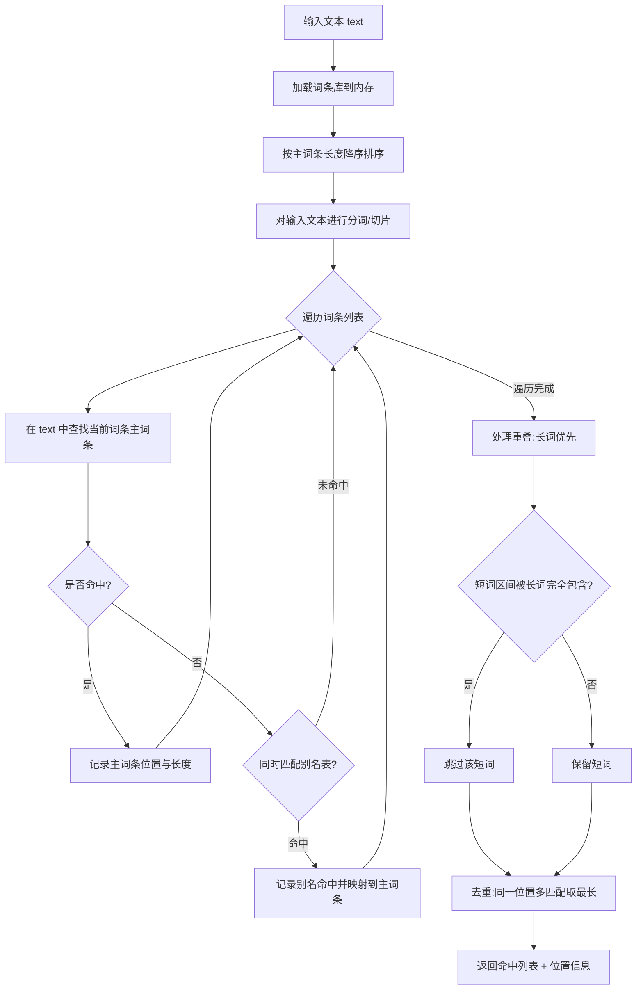

**词库优先策略流程图（Mermaid）：**

```mermaid
flowchart TD
    A[接收翻译请求] --> B[执行词库匹配]
    B --> C{词库命中?}
    C -->|是| D[组装词库结果 source=database]
    D --> E[返回结果]
    C -->|否| F[调用 AI 服务]
    F --> G{AI 调用成功?}
    G -->|是| H[组装 AI 结果 source=ai_temp]
    H --> E
    G ->|否| I[降级:返回基础提示]
    I --> J[返回 fallback=true 结果]
```

**来源标记逻辑（支撑 SRS-099）：**
- 词库命中：`source = "database"`，`confidence` 根据词条审核状态计算
  - `audit_status = approved` 且经多人投票验证 → `confidence = "high"`
  - `audit_status = approved` 但投票较少 → `confidence = "medium"`
  - `audit_status = pending`（仅管理员预览）→ `confidence = "low"`
- AI 生成：`source = "ai_temp"`，`confidence = "medium"`
  - 该结果不持久化到正式词库，仅作为本次会话临时结果
  - 用户认可后可触发"加入词库"流程，进入审核队列

**多语境处理逻辑（支撑 SRS-100）：**
- 查询 `word_contexts` 表，获取该词条的全部语境释义列表
- 若 `word_contexts` 无数据，调用 AI 补充生成多语境候选，结果以 `pending` 状态写入 `word_contexts`
- 根据上下文特征（关键词、场景词、文本主题）推断当前语境：
  - 命中明确场景标记 → 直接返回对应语境释义
  - 多场景同时命中 → 返回综合释义 + 各场景标记
  - 无明确场景 → 返回默认语境释义

**数据结构：**

```typescript
interface KeywordMatch {
  word: string;          // 命中的词条文本（主词条）
  position: number;      // 在输入文本中的起始字符位置
  length: number;        // 命中串长度（用于高亮区间）
  source: "database" | "ai_temp";  // 来源标记
  confidence: "high" | "medium" | "low";  // 置信度
  meaning: string;       // 释义/翻译
  category: string;      // 分类（职场/社交/网络/技术等）
}
```

### 5.2 AI 服务模块

**职责描述：**
- 封装大模型 API 调用（含鉴权、超时、重试）
- 管理 Prompt 模板（System + User）
- 解析大模型结构化输出并按 JSON Schema 校验
- 生成建议回复（suggested_reply）
- 失败降级：超时、格式错误、模型不可用时回退到纯词库模式

**类设计：AIService 类**

```typescript
class AIService {
  private apiKey: string;
  private endpoint: string;
  private model: string;
  private timeout: number = 5000;  // 默认超时 5s

  constructor(config: AIServiceConfig);

  // 主调用入口：接收原文 + 词库匹配结果，返回结构化 AI 结果
  async translate(text: string, matches: KeywordMatch[]): Promise<AIResult>;

  // 构建 System + User Prompt
  private build_prompt(text: string, matches: KeywordMatch[]): PromptPayload;

  // 解析模型响应，按 JSON Schema 校验
  private parse_response(raw: string): AIResult;

  // 失败降级：返回基础提示结构
  private fallback(text: string, matches: KeywordMatch[], reason: string): AIResult;

  // 生成建议回复（支撑 SRS-102）
  private generate_suggested_reply(context: string, translation: string): string;
}
```

**Prompt 模板设计：**

System Prompt（角色 + 输出格式 + 约束）：

```
你是一位中文语境翻译专家，擅长把网络黑话、职场话术、社交俚语翻译为通俗易懂的现代汉语。

【角色设定】
- 你精通当代中文互联网语境、职场黑话、社交潜台词
- 你能识别字面意思背后的真实意图（潜台词）
- 你能根据语境判断风险（冒犯性、敏感性、合规性）

【输出格式】
必须严格输出 JSON，符合以下结构，不要输出任何 JSON 之外的文本：
{
  "translation": string,         // 通俗翻译
  "keywords": [{word, meaning, category}],  // 命中关键词
  "context": string,             // 场景识别（职场/社交/网络/技术/生活）
  "subtext": string,             // 潜台词解读
  "suggestion": string,          // 行动建议
  "suggested_reply": string,     // 建议回复话术
  "risk": {level: "low"|"medium"|"high", types: string[], advice: string},
  "related": string[]            // 相关词条
}

【约束条件】
1. translation 必须是自然流畅的现代汉语，不能直接复述原话
2. 如词库命中词条已给出 meaning，翻译时优先采纳并融合
3. risk.level="high" 时 advice 不能为空
4. suggested_reply 必须与 context 场景匹配，长度不超过 50 字
5. 不允许输出 markdown 代码块包裹，必须直接输出 JSON
```

User Prompt（原文 + 词条 + 分类）：

```
【待翻译原文】
{{text}}

【已命中的词库词条】
{{#each matches}}
- 词条：{{this.word}}
- 释义：{{this.meaning}}
- 分类：{{this.category}}
- 置信度：{{this.confidence}}
{{/each}}

请基于以上信息输出符合 System Prompt 约定的 JSON。
```

**结构化输出 JSON Schema：**

```json
{
  "$schema": "http://json-schema.org/draft-07/schema#",
  "type": "object",
  "required": ["translation", "keywords", "context", "subtext",
               "suggestion", "suggested_reply", "risk", "related"],
  "properties": {
    "translation": {"type": "string", "minLength": 1, "maxLength": 500},
    "keywords": {
      "type": "array",
      "items": {
        "type": "object",
        "required": ["word", "meaning", "category"],
        "properties": {
          "word": {"type": "string"},
          "meaning": {"type": "string"},
          "category": {"type": "string"}
        }
      }
    },
    "context": {
      "type": "string",
      "enum": ["职场", "社交", "网络", "技术", "生活", "其他"]
    },
    "subtext": {"type": "string", "maxLength": 300},
    "suggestion": {"type": "string", "maxLength": 300},
    "suggested_reply": {"type": "string", "maxLength": 50},
    "risk": {
      "type": "object",
      "required": ["level", "types", "advice"],
      "properties": {
        "level": {"type": "string", "enum": ["low", "medium", "high"]},
        "types": {"type": "array", "items": {"type": "string"}},
        "advice": {"type": "string"}
      }
    },
    "related": {"type": "array", "items": {"type": "string"}}
  }
}
```

**建议回复生成逻辑（支撑 SRS-102）：**
- 根据 `context` 字段判断当前场景类型
- 职场场景：生成专业、得体、得体的回复话术，避免情绪化表达
  - 例：原文"老板说这个事你看着办" → suggested_reply="好的，我先整理两个方案给您选"
- 社交场景：生成轻松、合群、不越界的回复
  - 例：原文"你又来了" → suggested_reply="哈哈，我也想你了嘛"
- 网络场景：生成符合网络语境的轻量回复
- 高风险场景（`risk.level=high`）：suggested_reply 提示谨慎回复或不回复
- 生成结果写入 `suggested_reply` 字段，长度上限 50 字

**失败降级流程（Mermaid 流程图）：**

```mermaid
flowchart TD
    A[调用 AI 服务] --> B{响应是否在 5s 内返回?}
    B -->|否 超时| C[重试 1 次]
    C --> D{重试成功?}
    D -->|是| E[解析响应]
    D -->|否| F[降级为纯词库模式]
    B -->|是| E
    E --> G{JSON 解析与 Schema 校验通过?}
    G -->|否 格式错误| F
    G -->|是| H[标记 fallback=false 返回结果]
    F --> I[组装基础提示结果]
    I --> J[标记 fallback=true 返回结果]
```

降级响应结构示例：

```json
{
  "translation": "<词库命中词条释义拼接>",
  "keywords": [<词库匹配结果>],
  "context": "未知",
  "subtext": "AI 服务暂不可用，仅展示词库结果",
  "suggestion": "",
  "suggested_reply": "",
  "risk": {"level": "low", "types": [], "advice": ""},
  "related": [],
  "fallback": true,
  "fallback_reason": "ai_timeout | parse_error | service_unavailable"
}
```

### 5.3 词条管理模块

**职责描述：**
- 词条 CRUD（创建、读取、更新、删除）
- 词条审核流程管理（pending → approved/rejected）
- 词条发布流程（approved → 发布到 words 表，status=published）
- 风险标记管理（risk_level/risk_types/risk_advice）
- 用户投票触发自动审核入队
- 词条分类与相关词条关联

**类设计：WordService 类**

```typescript
class WordService {
  private db: Database;

  constructor(db: Database);

  // 创建词条（用户提交，进入 pending 队列）
  async create_word(input: WordCreateInput): Promise<Word>;

  // 读取词条（含多语境、别名、风险信息）
  async get_word(id: number): Promise<WordDetail>;

  // 更新词条（管理员或审核通过后作者可改）
  async update_word(id: number, input: WordUpdateInput): Promise<Word>;

  // 删除词条（软删除，置 status=deleted）
  async delete_word(id: number): Promise<void>;

  // 审核操作：pending → approved / rejected
  async audit_word(id: number, decision: AuditDecision, comment?: string): Promise<void>;

  // 发布词条：approved → status=published
  async publish_word(id: number): Promise<void>;

  // 投票：累计投票数，≥10 自动入审核队列
  async vote_word(id: number, userId: string): Promise<void>;

  // 设置风险标记（管理员）
  async set_risk(id: number, risk: RiskInput): Promise<void>;

  // 搜索词条
  async search_words(query: string, filter: WordFilter): Promise<Word[]>;
}
```

**CRUD 流程：**
1. Create：用户提交 → 写入 `words` 表 `status=pending` → 进入审核队列
2. Read：按 ID 查询，联表 `word_contexts`、`word_aliases`、`word_risks`
3. Update：管理员或原作者可修改；已发布词条修改后回到 `pending`
4. Delete：软删除，`status=deleted`，保留数据用于审计

**审核流程（Mermaid 流程图）：**

```mermaid
flowchart TD
    A[用户提交新词条] --> B[status=pending 写入 words 表]
    B --> C[进入审核队列]
    C --> D[管理员审核]
    D --> E{审核结果}
    E -->|approved| F[发布到 words 表 status=published]
    E -->|rejected| G[status=rejected 通知用户]
    F --> H[进入推荐池与排行榜候选]
    G --> I[用户可修改后重新提交]
    J[用户对词条投票] --> K{vote_count >= 10?}
    K -->|是| L[自动进入审核队列]
    K -->|否| M[继续累计投票]
    L --> D
```

**风险标记逻辑（支撑 SRS-101）：**
- 管理员在审核或后续管理中可设置：
  - `risk_level`：low / medium / high
  - `risk_types`：数组（如 `["冒犯性", "政治敏感", "地域歧视"]`）
  - `risk_advice`：使用建议文本
- 高风险词条（`risk_level=high`）处理策略：
  - 不进入推荐池（每日热词推荐算法过滤）
  - 不进入排行榜候选
  - 不出现在搜索默认结果（仅精确匹配可见）
  - 前端展示时显示红色卡片，并在释义前显示风险提示
- 前端根据 `risk_level` 展示不同颜色卡片：
  - `low`：绿色卡片
  - `medium`：黄色卡片
  - `high`：红色卡片 + 显著风险提示横幅

### 5.4 用户模块

**职责描述：**
- 用户注册与登录（账号密码 + 设备 ID 自动登录双通道）
- 用户学习记录管理
- 用户收藏管理
- 用户偏好管理（preferences JSON）
- 本地缓存策略（IndexedDB）

**类设计：UserService 类**

```typescript
class UserService {
  private db: Database;
  private cache: LocalCache;

  constructor(db: Database, cache: LocalCache);

  // 账号密码登录
  async login_by_password(account: string, password: string): Promise<UserSession>;

  // 设备 ID 自动登录（首次自动注册）
  async login_by_device(deviceId: string): Promise<UserSession>;

  // 登出
  async logout(session: UserSession): Promise<void>;

  // 数据同步：本地优先 → 联网同步 → 冲突合并
  async sync_data(session: UserSession): Promise<SyncResult>;

  // 偏好读写
  async get_preferences(userId: string): Promise<UserPreferences>;
  async set_preferences(userId: string, prefs: UserPreferences): Promise<void>;

  // 本地缓存读写
  async cache_word(word: Word): Promise<void>;
  async get_cached_word(id: number): Promise<Word | null>;
}
```

**登录流程（Mermaid 流程图）：**

```mermaid
flowchart TD
    A[启动 App] --> B{本地是否有有效 session?}
    B -->|是| C[使用本地 session 自动登录]
    B -->|否| D{用户选择登录方式?}
    D -->|账号密码| E[提交账号密码]
    E --> F{校验通过?}
    F -->|是| G[生成 session 持久化]
    F -->|否| H[提示错误并重试]
    D -->|设备 ID 自动登录| I[读取/生成设备 ID]
    I --> J[调用 login_by_device]
    J --> K{设备已注册?}
    K -->|是| L[返回已有用户 session]
    K -->|否| M[自动注册新用户并返回 session]
    G --> N[进入主界面]
    L --> N
    M --> N
    C --> N
```

**数据同步策略：**
- 本地优先：所有写操作先写入本地 IndexedDB，立即返回成功
- 联网同步：网络可用时异步推送本地变更到服务端
- 冲突合并：
  - 学习记录类（计数、状态）：服务端取最大值或并集
  - 偏好设置类：以最新时间戳为准
  - 收藏类：取并集，删除操作以显式删除标记为准
- 同步失败：保留本地变更，下次重试，不阻塞用户操作

**偏好管理：**
- `preferences` 字段为 JSON，结构示例：

```json
{
  "theme": "light | dark | auto",
  "font_size": "small | medium | large",
  "translation_style": "plain | humorous",
  "risk_filter": true,
  "daily_goal": 10,
  "notification_enabled": true
}
```

- 客户端可直接读写本地副本，同步时与服务端合并

**本地缓存策略：**
- 存储介质：IndexedDB
- 存储内容：词条详情、用户学习记录、收藏列表、最近翻译结果
- 淘汰算法：LRU（Least Recently Used）
- 容量上限：5MB
- 超过上限时按 LRU 顺序淘汰最久未访问的词条
- 词条更新时通过版本号判断是否需要刷新缓存

### 5.5 热词模块

**职责描述：**
- 每日热词推荐（10 个/天）
- 用户投票记录
- 热词排行榜
- 左滑右滑学习交互处理
- 学习进度统计

**类设计：HotWordService 类**

```typescript
class HotWordService {
  private db: Database;

  constructor(db: Database);

  // 获取每日热词推荐（10 个：7 热门 + 3 随机）
  async get_daily_hot(userId: string): Promise<HotWord[]>;

  // 用户投票
  async vote(wordId: number, userId: string): Promise<void>;

  // 获取排行榜
  async get_leaderboard(period: "daily" | "weekly" | "monthly"): Promise<HotWord[]>;

  // 处理左滑/右滑动作
  async handle_swipe(wordId: number, userId: string, direction: "left" | "right"): Promise<void>;

  // 统计用户学习进度
  async get_progress(userId: string): Promise<ProgressStats>;
}
```

**推荐算法：**
- 热度评分公式：
  ```
  hot_score = query_count * 0.6 + vote_count * 0.4
  ```
  - `query_count`：统计周期内该词条被查询的次数
  - `vote_count`：统计周期内该词条收到的用户投票数
- 每日推荐 10 个词条：
  - 7 个热门：按 `hot_score` 降序取前 N，排除已学习、排除高风险
  - 3 个随机：从剩余候选中随机抽取，保证多样性
- 排除规则：
  - 排除该用户已学习（`status=mastered` 或 `unmastered`）的词条
  - 排除 `risk_level=high` 的词条
  - 排除 `status != published` 的词条

**左滑右滑处理逻辑：**
- 右滑（掌握）：
  - 该词条 `status = mastered`
  - 用户经验值 `+5`
  - 从复习队列移除
- 左滑（未掌握）：
  - 该词条 `status = unmastered`
  - 加入复习队列
  - 不增加经验值
- 触发阈值：滑动距离 ≥ 80px 或 ≥ 卡片宽度的 25%

```mermaid
flowchart LR
    A[用户滑动卡片] --> B{滑动距离 >= 80px 或 >= 卡片宽度 25%?}
    B -->|否| C[回弹不动]
    B -->|是| D{滑动方向}
    D -->|右滑| E[status=mastered 经验+5]
    D -->|左滑| F[status=unmastered 加入复习队列]
    E --> G[加载下一张卡片]
    F --> G
```

**统计逻辑：**
- 已学计数：`COUNT(*) WHERE user_id=? AND status IN (mastered, unmastered)`
- 已掌握计数：`COUNT(*) WHERE user_id=? AND status=mastered`
- 未掌握计数：`COUNT(*) WHERE user_id=? AND status=unmastered`
- 掌握率：已掌握 / 已学 * 100%

### 5.6 成就模块（新增）

**职责描述：**
- 经验值累计与等级提升
- 称号解锁判定
- 徽章解锁判定（7 种）
- 成就点数计算与排行榜

**类设计：AchievementService 类**

```typescript
class AchievementService {
  private db: Database;

  constructor(db: Database);

  // 增加经验值并检查等级提升
  async add_exp(userId: string, action: ActionType): Promise<ExpResult>;

  // 查询当前等级与进度
  async get_level(userId: string): Promise<LevelInfo>;

  // 检查并解锁称号
  async check_titles(userId: string): Promise<Title[]>;

  // 检查并解锁徽章
  async check_badges(userId: string): Promise<Badge[]>;

  // 计算成就点数
  async get_achievement_score(userId: string): Promise<number>;

  // 获取成就排行榜
  async get_achievement_leaderboard(limit: number): Promise<UserAchievement[]>;
}
```

**经验值规则表：**

| 行为 | 经验值 |
| --- | --- |
| 学习一个热词 | +5 |
| 翻译一次 | +3 |
| 纠错通过 | +20 |
| 新词条通过 | +30 |
| 每日登录 | +1 |

**等级系统：**
- 等级范围：Lv1 - Lv10
- 经验阈值递增：

| 等级 | 所需累计经验 |
| --- | --- |
| Lv1 | 0 |
| Lv2 | 100 |
| Lv3 | 300 |
| Lv4 | 600 |
| Lv5 | 1000 |
| Lv6 | 1500 |
| Lv7 | 2100 |
| Lv8 | 2800 |
| Lv9 | 3600 |
| Lv10 | 4500 |

**称号解锁条件：**

| 称号 | 条件 |
| --- | --- |
| 黑话小白 | 默认（注册即获得） |
| 黑话达人 | 学习 ≥ 10 个词 |
| 黑话大师 | 学习 ≥ 50 个词 |

**徽章解锁条件（7 种）：**

| 徽章 | 解锁条件 |
| --- | --- |
| 初学者 | 完成第一次翻译 |
| 连续学习 7 天 | 连续 7 天每日学习 ≥ 1 个热词 |
| 收藏家 | 收藏 ≥ 20 个词条 |
| 词条贡献者 | 提交的词条 ≥ 1 个通过审核 |
| 学习达人 | 累计学习 ≥ 30 个热词 |
| 翻译狂人 | 累计翻译 ≥ 100 次 |
| 全勤奖 | 连续 30 天每日登录 |

**排行榜：**
- 成就点数计算公式：
  ```
  achievement_score = title_score + badge_count * 20 + level * 30
  ```
  - `title_score`：已解锁称号数量 * 50（每个称号 50 分）
  - `badge_count * 20`：每个徽章 20 分
  - `level * 30`：当前等级 * 30 分
- 排行榜按 `achievement_score` 降序排列，取前 N 名

### 5.7 反馈模块（新增）

**职责描述：**
- 接收用户对翻译结果的质量反馈
- 三类反馈处理：accurate / inaccurate / outdated
- 与纠错模块联动（inaccurate 自动创建 correction_report）
- 防重复提交校验
- 通知管理员复审

**类设计：FeedbackService 类**

```typescript
class FeedbackService {
  private db: Database;

  constructor(db: Database);

  // 提交质量反馈
  async submit_feedback(input: FeedbackInput): Promise<FeedbackResult>;

  // 校验是否已反馈过（防重复）
  async has_feedbacked(translationId: number, userId?: string,
                       deviceId?: string): Promise<boolean>;

  // 触发纠错联动（inaccurate 反馈自动创建纠错报告）
  async create_correction_report(translationId: number,
                                 feedback: FeedbackInput): Promise<void>;

  // 通知管理员复审（outdated 反馈）
  async notify_admin_for_review(wordId: number): Promise<void>;

  // 更新词条置信度权重（accurate 反馈）
  async adjust_confidence_weight(wordId: number): Promise<void>;
}
```

**质量反馈处理流程：**

```mermaid
flowchart TD
    A[用户提交反馈] --> B{反馈类型}
    B -->|accurate 准确| C[词条置信度权重 +1]
    C --> D[更新 word.confidence_weight]
    B -->|inaccurate 不准确| E[弹出文本框让用户补充说明]
    E --> F[用户提交补充文本]
    F --> G[自动创建 correction_report 纠错报告]
    G --> H[纠错报告进入审核队列]
    B -->|outdated 过时| I[词条标记"待复审" review_status=pending]
    I --> J[通知管理员复审]
    J --> K[管理员复审后更新释义或下线]
    D --> L[反馈结束]
    H --> L
    K --> L
```

**纠错联动：**
- 当用户提交 `inaccurate` 反馈并补充说明后，系统自动创建 `correction_report` 记录
- `correction_report` 字段包含：原词条 ID、原释义、用户建议释义、用户 ID/设备 ID、提交时间、审核状态
- 纠错报告进入审核队列，由管理员审核：
  - 通过 → 更新词条释义，原反馈用户获得 `+20` 经验值
  - 驳回 → 标记驳回原因，通知用户

**防重复策略：**
- 同一 `translation_id` + `user_id`（已登录用户）仅允许提交一次反馈
- 同一 `translation_id` + `device_id`（未登录用户）仅允许提交一次反馈
- 提交前调用 `has_feedbacked` 校验，已反馈则前端禁用反馈按钮并提示"您已反馈过"
- 数据库层增加唯一索引 `(translation_id, user_id)` 和 `(translation_id, device_id)` 兜底

---


## 6 软件单元的实现 ⭐

本章按软件单元分条列出后端与前端的实现文件清单，给出关键函数的签名与功能说明，并通过 Mermaid 依赖图说明单元间的协作结构，作为第 5 章详细设计的代码落地说明。

### 6.1 后端实现文件清单

后端基于 FastAPI + SQLAlchemy 框架实现，按"服务层—路由层—模型层"分层组织。后端实现文件清单如下表所示。

| 模块 | 文件路径 | 关键函数 | 说明 |
|---|---|---|---|
| 翻译引擎 | app/services/translation_engine.py | translate(), match_keywords() | 核心翻译逻辑 |
| AI服务 | app/services/ai_service.py | translate(), build_prompt(), fallback() | AI调用与降级 |
| 词条管理 | app/services/word_service.py | CRUD, review(), mark_risk() | 词条全生命周期 |
| 用户模块 | app/services/user_service.py | login(), sync_data() | 用户认证与同步 |
| 热词模块 | app/services/hotword_service.py | get_daily(), vote() | 热词推荐与统计 |
| 成就模块 | app/services/achievement_service.py | check_unlock(), get_ranking() | 成就解锁与排行 |
| 反馈模块 | app/services/feedback_service.py | submit(), link_correction() | 质量反馈处理 |
| API路由 | app/api/v1/*.py | 各路由处理器 | RESTful API |
| 数据模型 | app/models/*.py | SQLAlchemy ORM模型 | 15张表 |
| 数据库 | app/database.py | get_db(), engine | 连接管理 |

### 6.2 前端实现文件清单

前端基于 Uni-app + Vue 3 + Pinia 实现，按"页面—组件—状态—接口"四层组织。前端实现文件清单如下表所示。

| 模块 | 文件路径 | 关键组件/函数 | 说明 |
|---|---|---|---|
| 翻译页 | pages/translate/index.vue | translate(), showResult() | 翻译主页面 |
| 热词页 | pages/hotword/index.vue | loadDaily(), handleSwipe() | 热词学习 |
| 词条页 | pages/dictionary/index.vue | loadWords(), search() | 词典浏览 |
| 我的页 | pages/mine/index.vue | loadProfile() | 个人中心 |
| 词条详情 | pages/dictionary/detail.vue | loadDetail() | 词条详情 |
| 状态管理 | stores/*.ts | useTranslateStore等 | Pinia状态 |
| API封装 | api/*.ts | request() | 接口调用 |
| 组件 | components/*.vue | WordCard, RiskCard等 | 复用组件 |

### 6.3 关键函数说明

本节按模块列出核心函数的签名与功能说明，作为代码实现与第 5 章详细设计的对应入口。

#### 6.3.1 翻译引擎模块（app/services/translation_engine.py）

- `def translate(text: str, mode: str = "online") -> TranslateResult`
  - 功能：翻译入口函数，依次执行输入校验、关键词匹配、AI 调用、结果组装。
- `def match_keywords(text: str) -> list[KeywordHit]`
  - 功能：基于内存索引对输入文本进行长词优先、别名匹配、去重与重叠处理。
- `def build_result(text: str, hits: list, ai_resp: dict) -> TranslateResult`
  - 功能：将词库命中结果与 AI 返回结果合成为七模块结构化输出。
- `def mark_source(hit: KeywordHit) -> str`
  - 功能：标注关键词解释来源（词库/AI/混合），支撑 SRS-099 解释来源可视化。

#### 6.3.2 AI 服务模块（app/services/ai_service.py）

- `async def translate(text: str, hits: list, model: str = "deepseek") -> dict`
  - 功能：调用大模型生成七模块结构化结果，含超时与重试控制。
- `def build_prompt(text: str, hits: list, context: dict = None) -> str`
  - 功能：根据输入文本与词库命中情况构造 Prompt，含多语境与建议回复指引。
- `def fallback(text: str, hits: list, error: Exception) -> dict`
  - 功能：AI 调用失败时的降级处理，回退为纯词库模式结果。
- `def gen_suggested_reply(scenario: str, ai_resp: dict) -> str`
  - 功能：基于职场等场景生成可复制的建议回复话术，支撑 SRS-102。

#### 6.3.3 词条管理模块（app/services/word_service.py）

- `def create_word(data: WordCreate) -> Word` / `update_word()` / `delete_word()` / `get_word()`
  - 功能：词条 CRUD 全生命周期管理。
- `def search_words(keyword: str, category: int = None) -> list[Word]`
  - 功能：按关键词与分类检索词条，支持模糊匹配。
- `def review(submission_id: int, action: str) -> Word`
  - 功能：三段式审核流程的状态流转（待审核→初审→复审→通过/拒绝）。
- `def mark_risk(word_id: int, level: int, reason: str) -> Word`
  - 功能：标记词条风险等级（0/1/2），支撑 SRS-055、SRS-101 风险分层展示。

#### 6.3.4 用户模块（app/services/user_service.py）

- `def login(provider: str, code: str) -> Token`
  - 功能：支持微信、设备号、游客等多种登录方式，签发 JWT。
- `def sync_data(user_id: int, local: dict) -> dict`
  - 功能：本地学习数据与服务端的双向同步，含冲突合并策略。
- `def get_profile(user_id: int) -> UserProfile` / `update_preference()`
  - 功能：用户资料查询与偏好设置持久化。

#### 6.3.5 热词模块（app/services/hotword_service.py）

- `def get_daily(user_id: int) -> list[HotWordCard]`
  - 功能：返回每日 10 个热词卡片，含正反面内容。
- `def vote(word_id: int, user_id: int) -> VoteResult`
  - 功能：用户对热词的投票，含去重与排行榜更新。
- `def get_ranking() -> list[RankItem]` / `get_history(user_id: int)`
  - 功能：热词排行榜与个人学习历史查询。
- `def handle_swipe(direction: str, user_id: int, word_id: int)`
  - 功能：左滑"下一个"、右滑"上一个"的卡片切换与学习记录写入。

#### 6.3.6 成就模块（app/services/achievement_service.py）

- `def check_unlock(user_id: int) -> list[Achievement]`
  - 功能：基于用户行为触发称号、徽章、等级解锁条件。
- `def get_ranking(limit: int = 100) -> list[RankItem]`
  - 功能：成就排行榜查询。
- `def get_wall(user_id: int) -> AchievementWall`
  - 功能：个人成就墙数据组装，支撑 SRS-092。

#### 6.3.7 反馈模块（app/services/feedback_service.py）

- `def submit(translation_id: int, action: str, user_id: int) -> Feedback`
  - 功能：处理"有用/无用/纠错"三种反馈，含唯一性校验，支撑 SRS-103。
- `def link_correction(feedback_id: int, correction: CorrectionCreate) -> Correction`
  - 功能：将"纠错"反馈联动生成纠错记录，进入三段式审核流程。
- `def has_feedbacked(translation_id: int, user_id: int) -> bool`
  - 功能：查询用户是否已对某条翻译提交过反馈。

#### 6.3.8 路由层（app/api/v1/*.py）

- `app/api/v1/translate.py`：`POST /api/translate`、`POST /api/translate/dict` 翻译路由。
- `app/api/v1/words.py`：词条 CRUD、搜索、详情路由。
- `app/api/v1/hotword.py`：每日热词、投票、排行、历史路由。
- `app/api/v1/user.py`：登录、信息、偏好、同步路由。
- `app/api/v1/achievement.py`：成就解锁、排行、成就墙路由。
- `app/api/v1/feedback.py`：质量反馈与纠错联动路由。
- `app/api/v1/admin.py`：后台词条 CRUD、审核、风险标记、统计路由。

### 6.4 模块依赖关系

后端服务层模块依赖关系如下图所示，箭头方向表示"依赖于"。

```mermaid
graph TD
    A[API 路由层<br/>app/api/v1/*.py] --> S1[translation_engine<br/>翻译引擎]
    A --> S2[ai_service<br/>AI 服务]
    A --> S3[word_service<br/>词条管理]
    A --> S4[user_service<br/>用户模块]
    A --> S5[hotword_service<br/>热词模块]
    A --> S6[achievement_service<br/>成就模块]
    A --> S7[feedback_service<br/>反馈模块]

    S1 --> S2
    S1 --> S3
    S2 --> S1
    S5 --> S3
    S5 --> S6
    S7 --> S3
    S6 --> S4

    S1 --> DB[(database.py<br/>SQLAlchemy ORM)]
    S2 --> DB
    S3 --> DB
    S4 --> DB
    S5 --> DB
    S6 --> DB
    S7 --> DB
    DB --> M[(models/*.py<br/>15 张表 ORM)]
```

前端模块依赖关系如下图所示。

```mermaid
graph TD
    P1[pages/translate<br/>翻译页] --> C1[components/*<br/>复用组件]
    P2[pages/hotword<br/>热词页] --> C1
    P3[pages/dictionary<br/>词条页/详情] --> C1
    P4[pages/mine<br/>我的页] --> C1

    P1 --> ST[stores/*.ts<br/>Pinia 状态]
    P2 --> ST
    P3 --> ST
    P4 --> ST

    ST --> API[api/*.ts<br/>request 封装]
    API --> NET[uni.request<br/>HTTP 通信]
    NET --> BE[后端 API<br/>/api/v1/*]
```

---

## 7 需求的可追踪性 ⭐⭐

本章建立从 SRS（《软件需求规格说明》）每条需求到本设计文档相应章节、实现文件及验证方法的双向追踪关系，确保需求可追溯到设计、实现与验证，避免需求遗漏。验证方法代号对应 SRS 4.1 节定义：演示（a）、测试（b）、分析（c）、审查（d）、特殊（e）。

需求追踪矩阵按功能域分表组织，覆盖 SRS-001~074、SRS-088~103 共 90 条 CSCI 需求。

### 7.1 状态和方式需求追踪

| SRS编号 | 需求名称 | 设计章节 | 实现文件 | 验证方法 |
|---|---|---|---|---|
| SRS-001 | 词典模式 | 5.1、5.3 | app/services/translation_engine.py、word_service.py | 演示 |
| SRS-002 | 中译中模式 | 5.1、5.2 | app/services/translation_engine.py、ai_service.py | 演示、特殊 |
| SRS-003 | 离线模式 | 5.1、5.4 | app/services/translation_engine.py、user_service.py | 演示 |
| SRS-004 | 在线模式 | 5.1、5.2 | app/services/translation_engine.py、ai_service.py | 演示 |

### 7.2 翻译能力需求追踪

涵盖 SRS-005~014、SRS-093~094、SRS-099~103，共 17 条翻译能力需求。

| SRS编号 | 需求名称 | 设计章节 | 实现文件 | 验证方法 |
|---|---|---|---|---|
| SRS-005 | 文本输入 | 5.1 | app/services/translation_engine.py、pages/translate/index.vue | 演示、测试 |
| SRS-006 | 关键词识别 | 5.1 | app/services/translation_engine.py | 演示、测试、分析 |
| SRS-007 | 人话翻译 | 5.1、5.2 | app/services/translation_engine.py、ai_service.py | 演示、特殊 |
| SRS-008 | 关键词解释 | 5.1、5.3 | app/services/translation_engine.py、word_service.py | 演示 |
| SRS-009 | 语境判断 | 5.1、5.2 | app/services/translation_engine.py、ai_service.py | 演示、特殊 |
| SRS-010 | 潜台词分析 | 5.2 | app/services/ai_service.py | 演示、特殊 |
| SRS-011 | 行动建议 | 5.2 | app/services/ai_service.py | 演示、特殊 |
| SRS-012 | 风险提示 | 5.1、5.3 | app/services/translation_engine.py、word_service.py | 演示 |
| SRS-013 | 词库优先策略 | 5.1 | app/services/translation_engine.py | 演示、测试、分析 |
| SRS-014 | 翻译历史 | 5.1、5.4 | app/services/translation_engine.py、user_service.py | 演示 |
| SRS-093 | 新手引导流程 | 5.4 | pages/translate/index.vue、app/services/user_service.py | 演示、特殊 |
| SRS-094 | 对比式结果展示 | 5.1 | pages/translate/index.vue、app/services/translation_engine.py | 演示、特殊 |
| SRS-099 | 解释来源可视化 | 5.1 | app/services/translation_engine.py、pages/translate/index.vue | 演示 |
| SRS-100 | 多语境解释 | 5.1、5.3 | app/services/translation_engine.py、word_service.py | 演示 |
| SRS-101 | 风险分层展示 | 5.1、5.3 | app/services/translation_engine.py、word_service.py、components/*.vue | 演示 |
| SRS-102 | 建议回复 | 5.2 | app/services/ai_service.py、pages/translate/index.vue | 演示 |
| SRS-103 | 解释质量反馈 | 5.7 | app/services/feedback_service.py、pages/translate/index.vue | 演示 |

### 7.3 词典查询需求追踪

涵盖 SRS-015~020，共 6 条词典能力需求。

| SRS编号 | 需求名称 | 设计章节 | 实现文件 | 验证方法 |
|---|---|---|---|---|
| SRS-015 | 分类浏览 | 5.3 | app/services/word_service.py、pages/dictionary/index.vue | 演示 |
| SRS-016 | 关键词搜索 | 5.3 | app/services/word_service.py、pages/dictionary/index.vue | 演示 |
| SRS-017 | 词条详情 | 5.3 | app/services/word_service.py、pages/dictionary/detail.vue | 演示 |
| SRS-018 | 相关词条推荐 | 5.3 | app/services/word_service.py、pages/dictionary/detail.vue | 演示 |
| SRS-019 | 词条收藏 | 5.3、5.4 | app/services/word_service.py、user_service.py | 演示 |
| SRS-020 | 词条纠错/补充 | 5.3、5.7 | app/services/word_service.py、feedback_service.py | 演示 |

### 7.4 热词学习需求追踪

涵盖 SRS-021~026，共 6 条热词学习需求。

| SRS编号 | 需求名称 | 设计章节 | 实现文件 | 验证方法 |
|---|---|---|---|---|
| SRS-021 | 每日热词推荐 | 5.5 | app/services/hotword_service.py、pages/hotword/index.vue | 演示 |
| SRS-022 | 卡片式交互 | 5.5 | app/services/hotword_service.py、pages/hotword/index.vue | 演示 |
| SRS-023 | 左滑右滑 | 5.5 | app/services/hotword_service.py、pages/hotword/index.vue | 演示 |
| SRS-024 | 学习统计 | 5.5、5.6 | app/services/hotword_service.py、achievement_service.py | 演示 |
| SRS-025 | 热词排行榜 | 5.5 | app/services/hotword_service.py | 演示 |
| SRS-026 | 学习历史 | 5.5 | app/services/hotword_service.py | 演示 |

### 7.5 用户管理需求追踪

涵盖 SRS-027~030，共 4 条用户管理需求。

| SRS编号 | 需求名称 | 设计章节 | 实现文件 | 验证方法 |
|---|---|---|---|---|
| SRS-027 | 多种登录方式 | 5.4 | app/services/user_service.py、pages/mine/index.vue | 演示 |
| SRS-028 | 学习数据保存 | 5.4 | app/services/user_service.py | 演示 |
| SRS-029 | 偏好设置 | 5.4 | app/services/user_service.py、pages/mine/index.vue | 演示、特殊 |
| SRS-030 | 本地缓存 | 5.4 | app/services/user_service.py、stores/*.ts | 演示 |

### 7.6 后台管理需求追踪

涵盖 SRS-031~035，共 5 条后台管理需求。

| SRS编号 | 需求名称 | 设计章节 | 实现文件 | 验证方法 |
|---|---|---|---|---|
| SRS-031 | 词条 CRUD | 5.3 | app/services/word_service.py、app/api/v1/admin.py | 演示 |
| SRS-032 | 分类管理 | 5.3 | app/services/word_service.py、app/api/v1/admin.py | 演示 |
| SRS-033 | 用户提交审核 | 5.3 | app/services/word_service.py、app/api/v1/admin.py | 演示 |
| SRS-034 | 数据统计 | 5.3 | app/services/word_service.py、app/api/v1/admin.py | 演示、分析 |
| SRS-035 | 风险词条标记 | 5.3 | app/services/word_service.py、app/api/v1/admin.py | 演示 |

### 7.7 成就系统需求追踪

涵盖 SRS-088~092，共 5 条成就系统需求。

| SRS编号 | 需求名称 | 设计章节 | 实现文件 | 验证方法 |
|---|---|---|---|---|
| SRS-088 | 称号系统 | 5.6 | app/services/achievement_service.py | 演示 |
| SRS-089 | 徽章系统 | 5.6 | app/services/achievement_service.py | 演示 |
| SRS-090 | 等级系统 | 5.6 | app/services/achievement_service.py | 演示 |
| SRS-091 | 成就排行榜 | 5.6 | app/services/achievement_service.py | 演示 |
| SRS-092 | 成就展示 | 5.6 | app/services/achievement_service.py、pages/mine/index.vue | 演示 |

### 7.8 接口需求追踪

涵盖 SRS-036~046、SRS-095~098，共 15 条接口与界面需求。

| SRS编号 | 需求名称 | 设计章节 | 实现文件 | 验证方法 |
|---|---|---|---|---|
| SRS-036 | 移动端首页/翻译页 | 4.5 | pages/translate/index.vue、app/api/v1/translate.py | 演示 |
| SRS-037 | 移动端热词页 | 4.5 | pages/hotword/index.vue、app/api/v1/hotword.py | 演示 |
| SRS-038 | 移动端词条页 | 4.5 | pages/dictionary/index.vue、app/api/v1/words.py | 演示 |
| SRS-039 | 移动端我的页 | 4.5 | pages/mine/index.vue、app/api/v1/user.py | 演示 |
| SRS-040 | Web 端页面 | 4.5 | pages/*/*.vue | 演示 |
| SRS-041 | 词条详情页 | 4.5 | pages/dictionary/detail.vue | 演示 |
| SRS-042 | 快捷示例 | 4.5 | pages/translate/index.vue | 演示 |
| SRS-095 | 统一视觉规范 | 4.5 | components/*.vue | 审查、特殊 |
| SRS-096 | 交互动效规范 | 4.5 | components/*.vue、pages/*/*.vue | 审查、特殊 |
| SRS-097 | 异常状态设计 | 4.5 | components/*.vue、pages/*/*.vue | 审查 |
| SRS-098 | 深色模式规范 | 4.5 | components/*.vue、pages/*/*.vue | 审查 |
| SRS-043 | 翻译接口 | 5.2 | app/services/ai_service.py、app/api/v1/translate.py | 测试 |
| SRS-044 | 结构化输出 | 5.2 | app/services/ai_service.py、app/api/v1/translate.py | 测试 |
| SRS-045 | 多模型支持 | 5.2 | app/services/ai_service.py | 测试 |
| SRS-046 | 失败降级 | 5.2 | app/services/ai_service.py | 测试 |

### 7.9 数据与非功能需求追踪

涵盖 SRS-047~074，共 28 条数据与软件质量非功能需求。

| SRS编号 | 需求名称 | 设计章节 | 实现文件 | 验证方法 |
|---|---|---|---|---|
| SRS-047 | 内部接口 RESTful | 4.5 | app/api/v1/*.py | 测试 |
| SRS-048 | ORM 数据访问 | 4.5 | app/database.py、app/models/*.py | 测试 |
| SRS-049 | 词条数据 | 4.4 | app/models/*.py | 测试 |
| SRS-050 | 用户数据 | 4.4 | app/models/*.py | 测试 |
| SRS-051 | 翻译历史数据 | 4.4 | app/models/*.py | 测试 |
| SRS-052 | 纠错记录数据 | 4.4 | app/models/*.py | 测试 |
| SRS-053 | 数据适应性 | 3.6 | app/database.py | 测试 |
| SRS-054 | 终端适应性 | 3.6 | pages/*/*.vue（Uni-app 多端编译） | 测试 |
| SRS-055 | 风险等级标记 | 5.3 | app/services/word_service.py | 分析、审查 |
| SRS-056 | 高风险词条展示 | 5.3 | app/services/word_service.py、components/*.vue | 分析、审查 |
| SRS-057 | 三段式审核 | 5.3 | app/services/word_service.py | 分析、审查 |
| SRS-058 | 密钥保护 | 3.7 | app/config.py、.env | 审查 |
| SRS-059 | 输入安全 | 3.7 | app/api/v1/*.py、app/services/*.py | 审查 |
| SRS-060 | 环境需求 | 3.9 | —（运行时环境约束） | 测试 |
| SRS-061 | 服务器资源 | 3.10 | —（运行时资源约束） | 测试 |
| SRS-062 | 客户端资源 | 3.10 | pages/*/*.vue | 测试 |
| SRS-063 | 可靠性 | 3.11 | app/*（全模块） | 测试、分析 |
| SRS-064 | 可维护性 | 3.11 | 全部模块（单元测试覆盖率） | 分析、审查 |
| SRS-065 | 技术栈约束 | 3.12 | —（技术选型约束） | 测试、审查 |
| SRS-066 | 开源组件复用 | 3.12 | —（依赖清单） | 测试、审查 |
| SRS-067 | 人员/RBAC | 3.13 | app/api/v1/admin.py | 分析、审查 |
| SRS-068 | 培训/新手引导 | 3.14 | pages/translate/index.vue | 演示、审查 |
| SRS-069 | 后勤保障 | 3.15 | docker-compose.yml | 测试 |
| SRS-070 | 国际化预留 | 3.16 | pages/*/*.vue（i18n 资源） | 演示、审查 |
| SRS-071 | 无障碍 | 3.16 | components/*.vue、pages/*/*.vue | 演示、审查 |
| SRS-072 | 包装/交付物 | 3.17 | —（交付物清单） | 演示、审查 |
| SRS-073 | 优先级体系 | 3.18 | —（需求清单） | 分析、审查 |
| SRS-074 | 关键程度判定 | 3.18 | —（追踪矩阵） | 分析、审查 |

### 7.10 追踪覆盖统计

| 功能域 | 需求条数 | 设计章节覆盖 | 实现文件覆盖 | 验证方法覆盖 |
|---|---|---|---|---|
| 状态和方式（7.1） | 4 | 100% | 100% | 100% |
| 翻译能力（7.2） | 17 | 100% | 100% | 100% |
| 词典查询（7.3） | 6 | 100% | 100% | 100% |
| 热词学习（7.4） | 6 | 100% | 100% | 100% |
| 用户管理（7.5） | 4 | 100% | 100% | 100% |
| 后台管理（7.6） | 5 | 100% | 100% | 100% |
| 成就系统（7.7） | 5 | 100% | 100% | 100% |
| 接口需求（7.8） | 15 | 100% | 100% | 100% |
| 数据与非功能（7.9） | 28 | 100% | 100% | 100% |
| **合计** | **90** | **100%** | **100%** | **100%** |

**结论：** 全部 90 条 CSCI 需求均建立了到设计章节、实现文件与验证方法的双向追踪关系，未发现需求遗漏。其中 P0 级关键需求 24 条全部具备完整追踪链路，满足 SRS 4.3 节合格性判定准则要求。

---

## 8 注解 ⭐

本章应包含有助于理解本文档的一般信息。

### 8.1 术语表

| 术语 | 解释 |
|---|---|
| CSCI | Computer Software Configuration Item，计算机软件配置项 |
| CSCI 级 | 涉及整个软件配置项的设计层面 |
| 软件单元 | 软件设计中最小的可测试单元 |
| 中译中 | 将包含黑话/梗/术语的中文翻译成普通人能理解的人话 |
| 人话翻译 | 将黑话翻译成通俗易懂的中文表达 |
| 词条 | 词库中的一个条目，包含词语、解释、示例等 |
| 词库 | 全部词条的集合，初始1200条 |
| 热词 | 查询量大、投票数高的词条 |
| 词库优先策略 | 先匹配本地词库，未命中再调用AI |
| 降级模式 | AI服务不可用时退化为纯词库模式 |
| 多语境 | 同一关键词在不同场景下的不同含义 |
| 来源可视化 | 标注解释来源（词库/AI）和置信度 |
| 风险分层 | 按低/中/高三层展示词条风险信息 |
| 建议回复 | 针对翻译结果生成的可直接使用的回复话术 |
| 质量反馈 | 用户对翻译结果准确性的评价反馈 |
| FastAPI | 现代、快速的 Python Web 框架，基于 ASGI |
| Uni-app | 跨端应用开发框架，一套代码多端运行 |
| SQLAlchemy | Python 生态最成熟的 ORM 框架 |
| Pinia | Vue3 官方推荐的状态管理库 |
| ORM | 对象关系映射，用对象操作数据库 |
| RESTful API | 一种 API 设计风格，基于 HTTP 方法语义 |
| JWT | JSON Web Token，用于用户认证 |
| LRU | Least Recently Used，最近最少使用缓存淘汰策略 |

### 8.2 缩略语表

| 缩略语 | 全称 | 中文含义 |
|---|---|---|
| CSCI | Computer Software Configuration Item | 计算机软件配置项 |
| SRS | Software Requirements Specification | 软件需求规格说明 |
| SDD | Software Design Description | 软件设计说明 |
| API | Application Programming Interface | 应用程序编程接口 |
| AI | Artificial Intelligence | 人工智能 |
| ORM | Object-Relational Mapping | 对象关系映射 |
| H5 | HTML5 | 第五代超文本标记语言 |
| JSON | JavaScript Object Notation | JavaScript 对象表示法 |
| CRUD | Create, Read, Update, Delete | 增删改查 |
| LRU | Least Recently Used | 最近最少使用 |
| JWT | JSON Web Token | JSON Web 令牌 |
| UI | User Interface | 用户界面 |
| UX | User Experience | 用户体验 |
| PV | Page View | 页面访问量 |
| UV | Unique Visitor | 独立访客 |
| ASGI | Asynchronous Server Gateway Interface | 异步服务器网关接口 |
| ER | Entity-Relationship | 实体关系 |
| FK | Foreign Key | 外键 |
| PK | Primary Key | 主键 |

### 8.3 修订记录

| 版本 | 日期 | 修改内容 | 修改人 |
|---|---|---|---|
| V0.1 | 2026-06-29 | 初始大纲 | 项目组 |
| V1.0 | 2026-06-29 | 完整版，按 GJB 438C-2021 标准展开，对齐 SRS V1.1 | 项目组 |

### 8.4 优先级说明

| 优先级 | 标记 | 说明 |
|---|---|---|
| P0 必写 | ⭐⭐⭐ | 核心章节，必须详细写 |
| P1 重要 | ⭐⭐ | 重要章节，需要充实 |
| P2 简化 | ⭐ | 格式性章节，简要说明即可 |

---

## 附录（可选）
